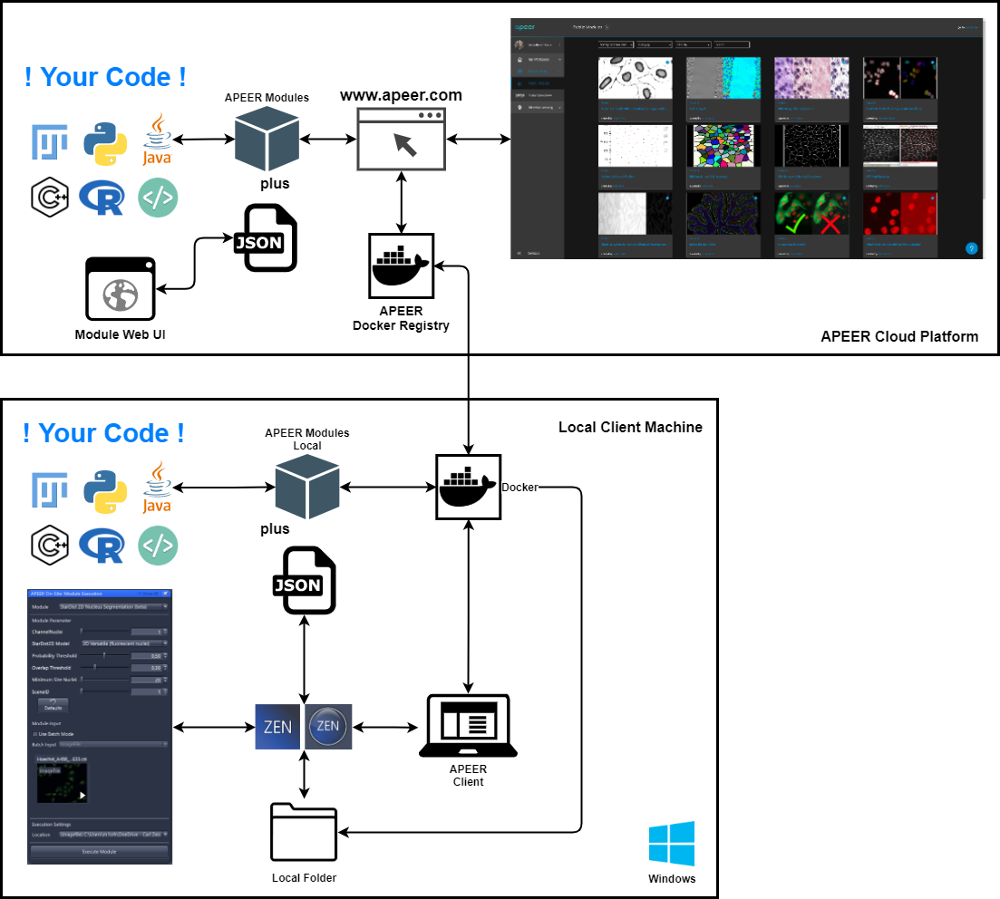
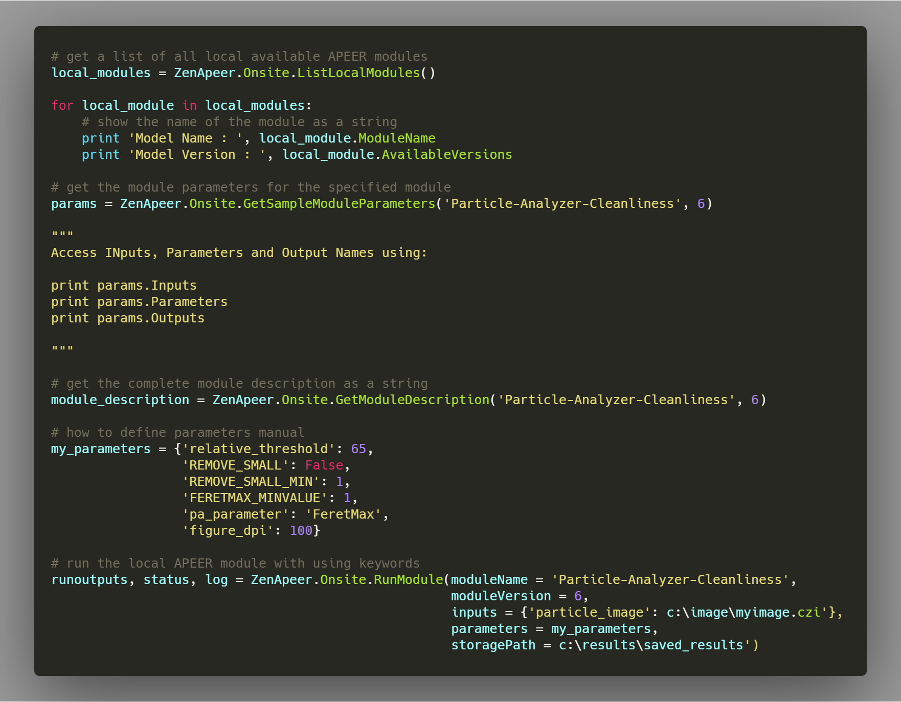

# ZEN-APEER Integration

## ZEN APEER (on-site)

Starting with ZEN blue 3.2 and ZEN core 3.0 it is possible to run your own code directly integrated in ZEN workflows. This is achieved by using APEER modules directly in ZEN. Such modules typically consist of

- your code (Python, Fiji, R, C#, C++, ...)
- dockerfile
- modul_specification.json

Inside ZEN the module specification is used to render the UI of an APEER module excatly as it would look like on the APEER cloud platform. For more information and details about the requirements please refer to to official documentation: **[APEER - ZEN Integration](https://docs.apeer.com/hybrid/zen-integration)**

## How does it work

The general scheme of this ZEN APEER integration is visualized below

## Scripting Integration

It is also possible to use the docker integration from within the ZEN scripting interface.

---

## Disclaimer

This is an collection of scripts that is free to use for everybody.
Carl Zeiss Microscopy GmbH's ZEN software undertakes no warranty concerning the use of those scripts, image analysis settings and ZEN experiments. Use them on your own risk.

Additionally Carl Zeiss Microscopy GmbH's ZEN software allows connection to the third party software packages.

Therefore Carl Zeiss Microscopy GmbH undertakes no warranty concerning those software packages, makes no representation that they will work on your system and/or hardware and will not be liable for any damages caused by the use of this extension.

By using any of those examples you agree to this disclaimer.

Version: 2020.07.16

Copyright (c) 2019 Carl Zeiss AG, Germany. All Rights Reserved.
