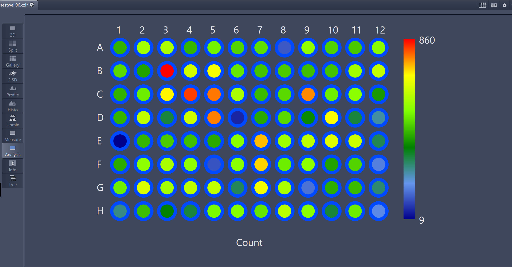

# BioApps

**BioApps** are typical imaging workflows in the field of Life Science Research and similar or related fields. Typical steps involved are

* Image Acquisition with certain parameters on specific imaging systems
* Image Processing and Analysis
* Data Processing
* Visualization of the results

Typical example for such applications are:

* Cell Counting
* Scratch Assay
* Translocation Assay
* Live vs. Death Assay
* Proliferation Essay
* Confluence Measurements
* ...

This repository will contain some useful Image Analysis Settings, tools and scripts that can be used for various things "surrounding" those **BioApps**.

The Image Analysis Settings (*.czias) can be used inside ZEN Blue or ZEN Core with the example images. Depending on the real images those settings must be obviously modified.

Since the concept of **Open Application Development** (OAD) is about connecting the ZEN world with other valuable software tools, those example will also contain non-ZEN scripts etc.

## Counting Cells - the Classical Example

Those two short videos demonstrate how to do a simple cell count in ZEN blue and display a heatmap. The [1st video](Count_Cells_Simple_Setup.gif) explains how to setup the IA analysis and the [2nd video](Run_Count_Cells_96wellplate_1GB_File_RealTime.gif) shows how is runs in Real Time (on a laptop).

Remark: The heatmap is shown at the end of the 2nd video.

Image Data:

* CZI file with 96 scenes from a typical wellplate sample carrier on a CellDiscoverer 7
* file size is rather small = approx. 1GB

The image analysis is quite straight forward and included the following steps:

* Smoothing using Median Filter
* Triangle Threshold
* Filter small particles
* Fill Holes
* Separate by Watershed
