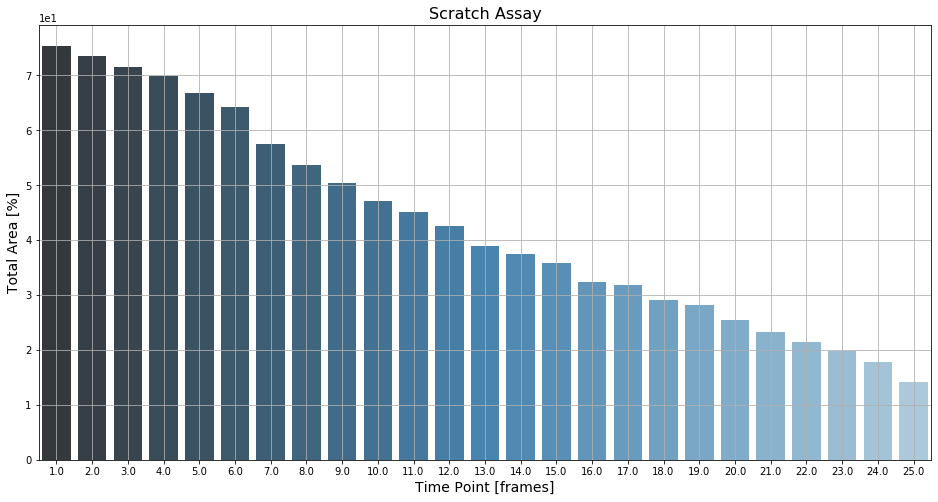

```python
# do the required imports
import pandas as pd
import numpy as np
import matplotlib.pyplot as plt
import seaborn as sns
import os
import sys
module_path = os.path.abspath(os.path.join('..'))
if module_path not in sys.path:
    sys.path.append(module_path)
    
import bioapps_tools as bap
```


```python
# read data and convert to dataframe
filename = r'Scratch_Assay_T=25_Bin2x2_analyzed Regions Scratch.csv'

df, headers, sep = bap.get_csvdata(filename, num_nonmp=2)
df[:5]
```

    No correction of types possible for column:  ImageIndexTime::Image Index Time!!I
    No correction of types possible for column:  ImageSceneContainerName::Image Scene Container Name 
    No correction of types possible for column:  ImageSceneColumn::Image Scene Column Index!!I
    No correction of types possible for column:  ImageSceneRow::Image Scene Row Index!!I
    


<div>
<style scoped>
    .dataframe tbody tr th:only-of-type {
        vertical-align: middle;
    }

    .dataframe tbody tr th {
        vertical-align: top;
    }

    .dataframe thead th {
        text-align: right;
    }
</style>
<table border="1" class="dataframe">
  <thead>
    <tr style="text-align: right;">
      <th></th>
      <th>ID::ID!!I</th>
      <th>RegionsCount::Count!!I</th>
      <th>RegionsArea::Area!!R</th>
      <th>RegionsAreaPercentage::Area Percentage!!R</th>
      <th>ImageIndexTime::Image Index Time!!I</th>
      <th>ImageSceneContainerName::Image Scene Container Name</th>
      <th>ImageSceneColumn::Image Scene Column Index!!I</th>
      <th>ImageSceneRow::Image Scene Row Index!!I</th>
    </tr>
  </thead>
  <tbody>
    <tr>
      <th>1</th>
      <td>1.0</td>
      <td>1</td>
      <td>7758.96</td>
      <td>75.421093</td>
      <td>1.0</td>
      <td>NaN</td>
      <td>0.0</td>
      <td>0.0</td>
    </tr>
    <tr>
      <th>2</th>
      <td>1.0</td>
      <td>1</td>
      <td>7573.60</td>
      <td>73.619298</td>
      <td>2.0</td>
      <td>NaN</td>
      <td>0.0</td>
      <td>0.0</td>
    </tr>
    <tr>
      <th>3</th>
      <td>1.0</td>
      <td>1</td>
      <td>7360.08</td>
      <td>71.543773</td>
      <td>3.0</td>
      <td>NaN</td>
      <td>0.0</td>
      <td>0.0</td>
    </tr>
    <tr>
      <th>4</th>
      <td>1.0</td>
      <td>1</td>
      <td>7194.68</td>
      <td>69.936000</td>
      <td>4.0</td>
      <td>NaN</td>
      <td>0.0</td>
      <td>0.0</td>
    </tr>
    <tr>
      <th>5</th>
      <td>1.0</td>
      <td>2</td>
      <td>6875.40</td>
      <td>66.832434</td>
      <td>5.0</td>
      <td>NaN</td>
      <td>0.0</td>
      <td>0.0</td>
    </tr>
  </tbody>
</table>
</div>


```python
# define what to plot etc.
xd = r'ImageIndexTime::Image Index Time!!I'
yd = r'RegionsAreaPercentage::Area Percentage!!R'
plot_title = 'Scratch Assay'
plot_xaxis = 'Time Point [frames]'
plot_yaxis = 'Total Area [%]'
cp = 'Blues_d'

# save plot with options
savefig = True
figdpi=100
```


```python
# create figure and plot
fig, ax = plt.subplots(1,1, figsize=(16, 8))
ax = sns.barplot(x=xd, y=yd, palette=cp, data=df, ax=ax)

# set plot title
ax.set_title(plot_title, fontsize=16)

# format x and y axis
ax.set_xlabel(plot_xaxis, fontsize=14)
ax.set_ylabel(plot_yaxis, fontsize=14)

# optional scientific annotation for axis
ax.ticklabel_format(axis='y', style='scientific', scilimits=(0, 0))

# toggle grid
ax.grid(True)
```





```python
if savefig:
    savename = filename[:-4] + '_Area-Time.png'
    fig.savefig(savename, dpi=figdpi, orientation='portrait', transparent=False, facecolor=None)
```

