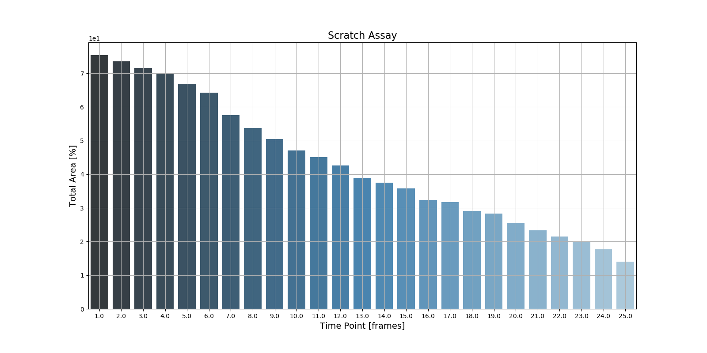

## Scratch Assay

Scratch Assay analysis inside ZEN is quite simple and can be effectively carried using the Variance Segmenter. Try it out using the Image Analysis Setting and the example dataset directly.

