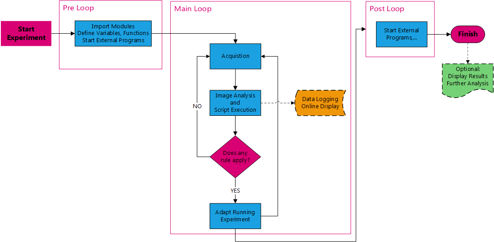
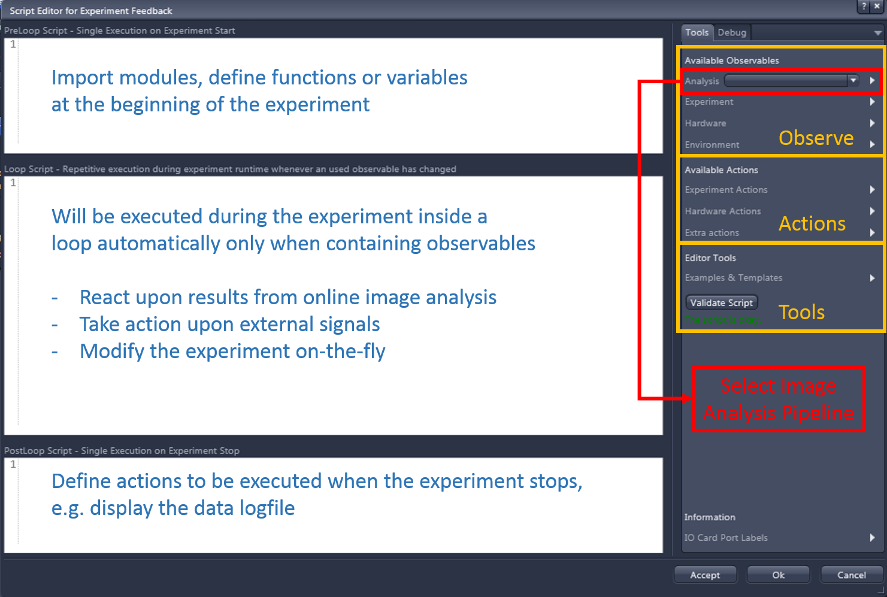
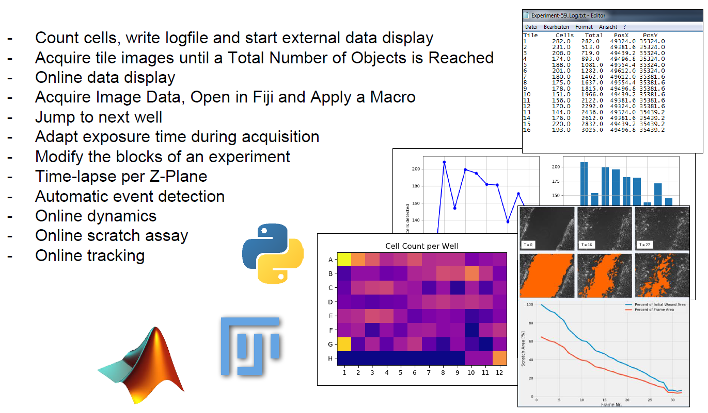

## Experiment Feedback

### Key Facts

* **Adaptive Acquisition Engine** allows modifying **running experiments** using Python scripts
* Python Scripts can access the **current system status** and results from **Online Image Analysis** on runtime during the experiment
* **Data Logging** or starting an **External Application** (Python, Fiji, MATLAB, …), directly from within the imaging experiment is possible

### Important Features

Experiment Feedback is a very flexible concept and allow ofr example for the following workflows or applications

* Create dynamic acquisition-experiments 
* Observe parameters during acquisition via online image analysis
* Monitor the status of the microscope and/or the sample 
* Automatically react on changes of the sample or other parameters
* Modify the hardware/experiment parameters during the acquisition
* increase integration time when the sample bleaches
* stop the acquisition after a certain number of objects was detected
* Create custom log-files, integrate data logging in the ZEN experiment 
* Start external applications (Python, Matlab,….)
* Display measurement results already during image acquisition
* Track objects online in XY

The general Experiment feedback workflow has three major parts, where the so-called **"Main Loop"** is the most important. Here it is possible to define the rulles that allow the user to react on the results retrived from the **Online Image Analysis** and adapt the running experiments, send the respective signal to external application or log the data.

***

***

Those Experiment Feedback scripts use similar to the other ZEN python scripts IronPython to control the workflows within the running acquisition.

***

***

## Experiment Feedback - Examples

The tutorial contains several ready-to-use examples for instructive and typical workflows that allow to get familar with the possibilities of that tool.

