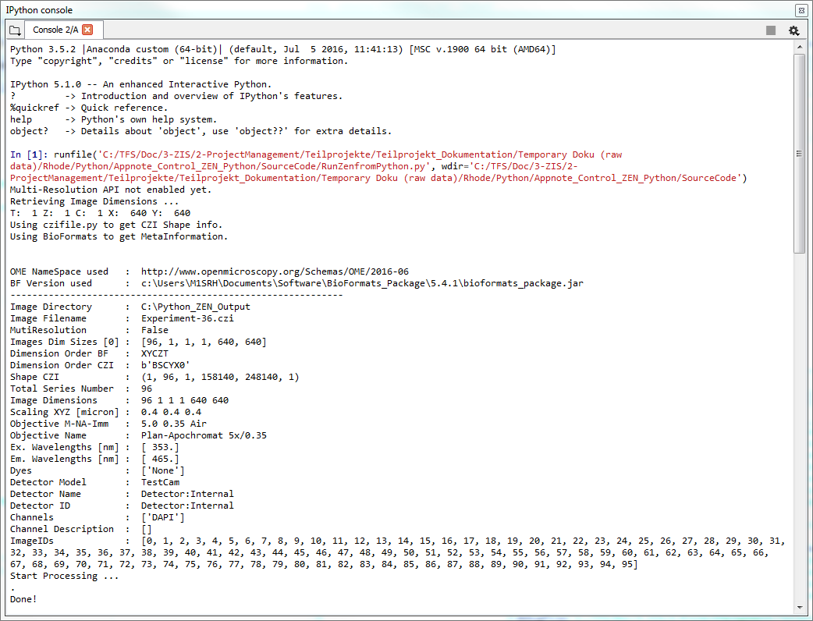
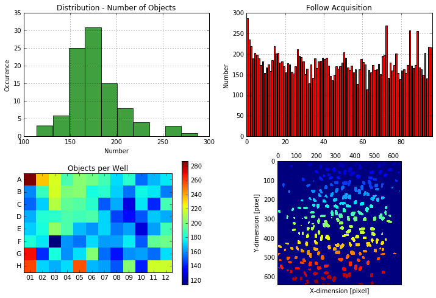

## Regsitering COM Functionality

To be able to use ZEN services in a COM environment, the ZEN functionality must be registered as follows using the following BAT-File, which **must be executed as administrator**.

```bat
:: regScripting_zen311.bat --> works with ZEN 3.11 or newer !!!
:: This needs to be run with administrator privileges !!!

echo off

SET DLL1="c:\Program Files\Carl Zeiss\ZEN 2\ZEN 2 (blue edition)\Zeiss.Micro.Scripting.comhost.dll"
SET DLL2="c:\Program Files\Carl Zeiss\ZEN 2\ZEN 2 (blue edition)\Zeiss.Micro.LM.Scripting.comhost.dll"
SET DLL3="c:\Program Files\Carl Zeiss\ZEN 2\ZEN 2 (blue edition)\Zeiss.Micro.Scripting.Research.comhost.dll"

regsvr32.exe /u %DLL1%
regsvr32.exe /u %DLL2%
regsvr32.exe /u %DLL3%

regsvr32.exe %DLL1%
regsvr32.exe %DLL2%
regsvr32.exe %DLL3%

popd
pause
```

The final result of this set of commands is that the .NET classes and structures within

- **Zeiss.Micro.Scripting.comhostdll**
- **Zeiss.Micro.Scripting.Research.comhost.dll**
- **Zeiss.Micro.LM.Scripting.comhost.dll**

are made known and accessible within the COM environment as well.

**Remark: Please note that you must edit the BAT-file and adapt the path location, where the DLLs can be found to your needs.**

## COM - Python Example

This application note will explain how to create a workflow using the ZEN-Python connection. The basic idea is to control everything from within Python (Master). While ZEN internally is using IronPython, this notes describes how to control ZEN from within a CPython implementation.

The ZEN Image Acquisition (Slave) software is "only" doing the image acquisition. The signal to start the experiment is send from Python to ZEN.

When the experiment is finished, the CZI data are imported into Python using BioFormats and "some" simple image analysis is carried out to underline the workflow concept.

***



***


