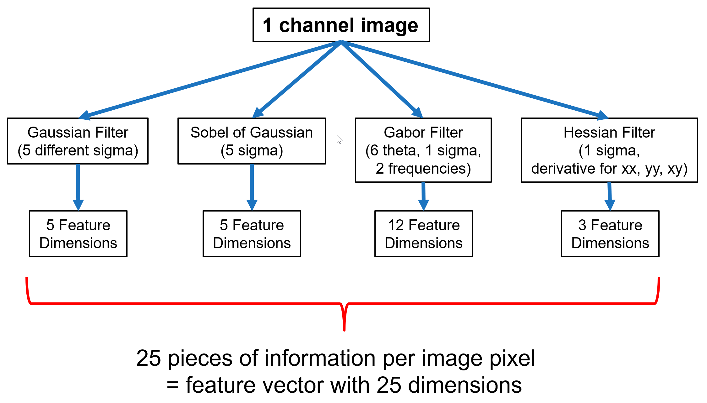

- [ZEN Intellesis - Feature Extractors](#zen-intellesis---feature-extractors)
  - [General Remarks](#general-remarks)
    - [Basic Features 25](#basic-features-25)
    - [Basic Features 33](#basic-features-33)
    - [Deep Features from VGG19](#deep-features-from-vgg19)

# ZEN Intellesis - Feature Extractors

## General Remarks

Intellesis allows to use different feature extractors to create the feature vector that will be used for the subsequent Pixel Classification. To focus on simplicity and ease-of-use the tool offers seven different pre-configured feature extractors.

For calculating the features of one specific pixel, various filters with various filter sizes and parameters are applied to the region around this pixel. All the filter results are concatenated yielding the final feature vector describing the pixel.
Considering the filter sizes of all filters we obtain a dimensionality of 25/33 for the Basic Features 25/33.

For **Deep Feature Extraction** ZEN Intellesis uses the results of an intermediate layer of the VGG19 network as input features for the Pixel Classification using a **Random Forest Classifier**. The model is trained on a subset of the ImageNet database, which is used in the ImageNet Large-Scale Visual Recognition Challenge (ILSVRC). The entire image is put into the VGG19 network and take the output from an intermediate layer of that network as feature vector.

### Basic Features 25

- **Gaussian Filter** (5 different sigma) -> 5 dimensions
  - sigma = 0.7, 1.0, 2.0, 4.0, 8.0 (pixel)
- **Sobel of Gaussians** (5 different sigma) -> 5 dimensions
  - sigma = 0.7, 1.0, 2.0, 4.0, 8.0 (pixel)
- **Gabor Filter** (1 sigma, 6 theta, 2 frequencies) -> 12 dimensions
  - sigma = 1.0 (pixel)
  - theta = 0, 60, 120, 180, 240, 300 (degree)
  - frequencies = 0.1, 0.2 (pixel)
- **Hessian Filter** (1 sigma, 3 derivatives) -> 3 dimensions
  - sigma = 1.0 (pixel)
  - derivatives in direction xx, yy and xy

### Basic Features 33

- **Gaussian Filter** (20 different sigma) -> 20 feature dimensions
- sigma = 0.0, 0.5, 1.0, 1.5, 2.0, 2.5, 3.0, 3.5, 4.0 , 4.5, 5.0, 5.5, 6.0, 6.5, 7.0, 7.5, 8.0, 8.5, 9.0, 9.5 (pixel)
- **Sobel Filter** -> 1 dimension
- **Gabor Filter** (2 sigma, 6 theta, 2 frequencies) -> 12 dimensions
  - sigma = 1.0, 3.0 (pixel)
  - theta = 180 (degree)
  - frequencies = 0.05, 0.25 (pixel)
- **Mean Filter** (5 sizes) -> 5 dimensions
  - sizes = 1.0, 2.0, 4.0, 8.0, 16.0 (pixel)
- **Hessian Filter** (1 sigma, 3 derivatives) -> 3 dimensions
  - sigma = 1.0 (pixel)
  - derivatives in direction xx, yy and xy

### Deep Features from VGG19

For **Deep Feature Extraction** ZEN Intellesis uses the results of an intermediate layer of the VGG19 network as input features for the Pixel Classification using a **Random Forest Classifier**.

The model is trained on a subset of the ImageNet database, which is used in the ImageNet Large-Scale Visual Recognition Challenge (ILSVRC). The entire image is put into the VGG19 network and take the output from an intermediate layer of that network as feature vector.

- **Deep Features 50** -> output from the layer conv2_2 and reduction of feature dimension by applying random transformation -> 50 dimensions
- **Deep Features 64** -> output from the layer conv1_2 -> 64 dimensions
- **Deep Features 70** -> output from the layer conv3_2 and reduction of feature dimension by applying random transformation -> 70 dimensions
- **Deep Features 128** -> output from the layer conv2_2 -> 128 dimensions
- **Deep Features 256** -> output from the layer conv3_2 -> 256 dimensions
