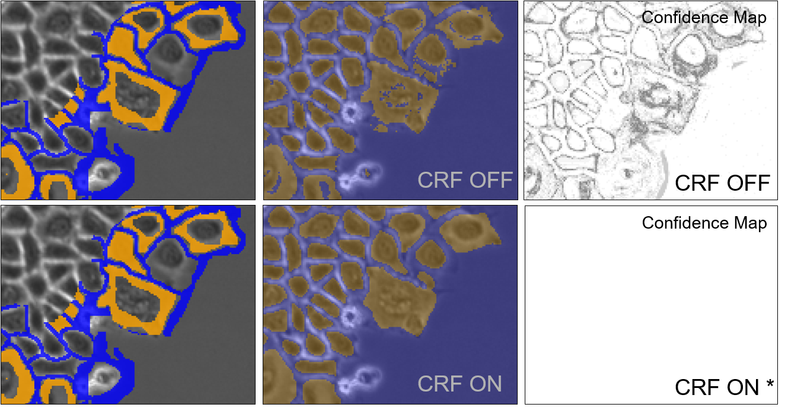

- [ZEN Intellesis - Post Processing](#zen-intellesis---post-processing)
  - [Conditional Random Fields (CRF)](#conditional-random-fields-crf)
    - [Application Example](#application-example)

# ZEN Intellesis - Post Processing

## Conditional Random Fields (CRF)

**CRF tries to create smoother and shaper borders between objects by re-classifying pixels based on confidence levels in their neighborhood.**

- Multi-class image segmentation and labeling use conditional random fields defined over pixels or image regions.
- fully connected CRFs models are defined on the complete set of pixels in an image
- CRF used a highly efficient approximate inference algorithm for fully connected CRF models in which the pairwise edge potentials are defined by a linear combination of Gaussian kernels
- the dense connectivity at the pixel level substantially improves segmentation and labeling accuracy

*Conditional random fields (CRFs) are a class of [statistical modeling method](https://en.wikipedia.org/wiki/Statistical_model) often applied in [pattern recognition](https://en.wikipedia.org/wiki/Pattern_recognition) and [machine learning](https://en.wikipedia.org/wiki/Machine_learning) and used for [structured prediction](https://en.wikipedia.org/wiki/Structured_prediction). CRFs fall into the sequence modeling family. Whereas a discrete [classifier](https://en.wikipedia.org/wiki/Statistical_classification) predicts a label for a single sample without considering "neighboring" samples, a CRF can take context into account; e.g., the linear chain CRF (which is popular in [natural language processing](https://en.wikipedia.org/wiki/Natural_language_processing)) predicts sequences of labels for sequences of input samples.*

Further readings and additional information:

- [https://en.wikipedia.org/wiki/Conditional_random_field](https://en.wikipedia.org/wiki/Conditional_random_field)

- [Efficient Inference in Fully Connected CRFs with Gaussian Edge Potentials](https://arxiv.org/abs/1210.5644v1)

### Application Example

Since the confidence map after CRF post processing does not reflect the probabilities from the Random Forrest Classification or the prediction by a deep neural network anymore a matrix of one will be returned (from ZEN 3.0 or better) to prevent misuse of the probability threshold sliders.
