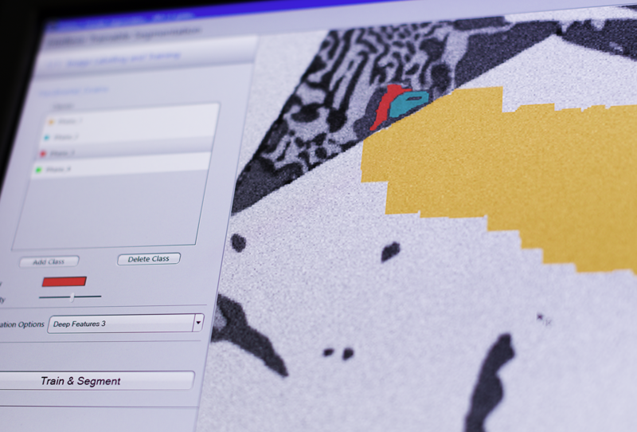
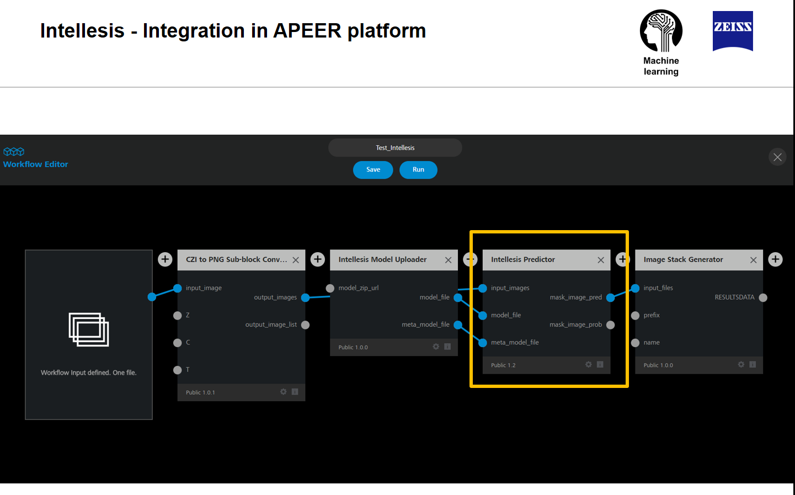
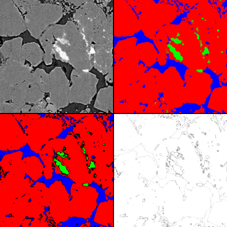
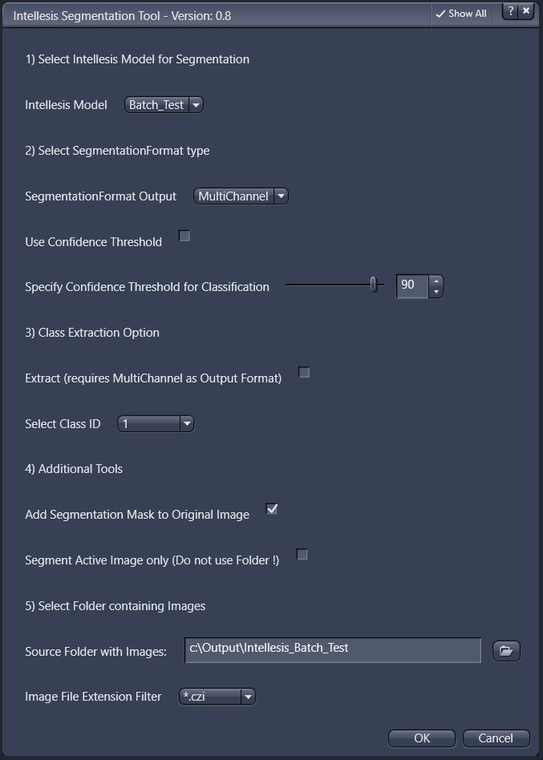
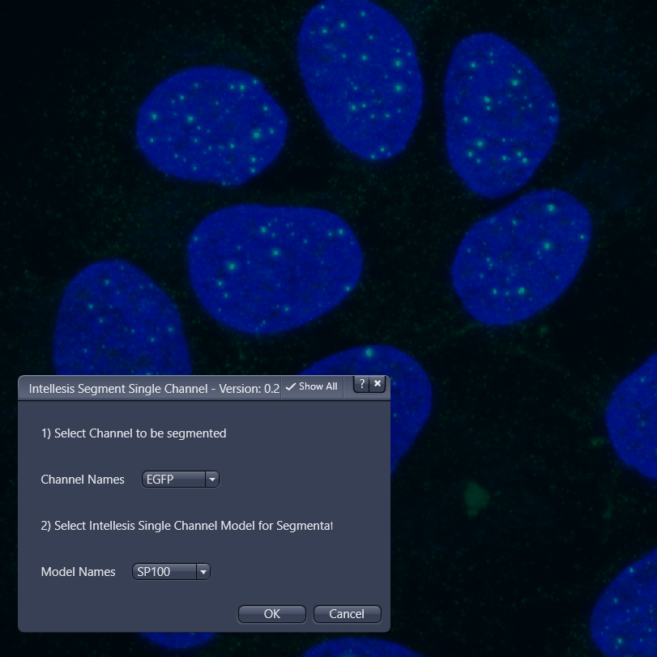
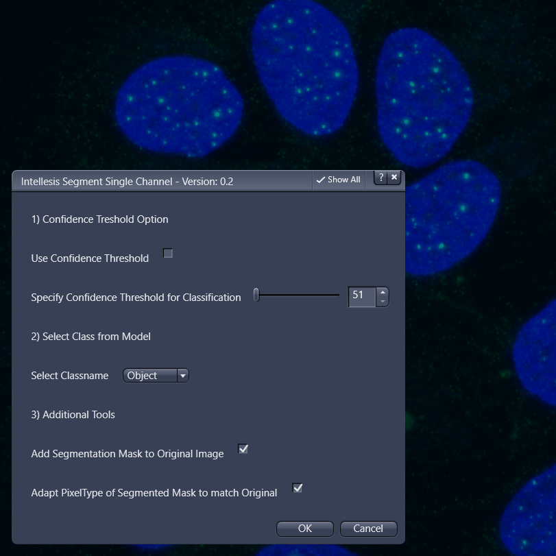
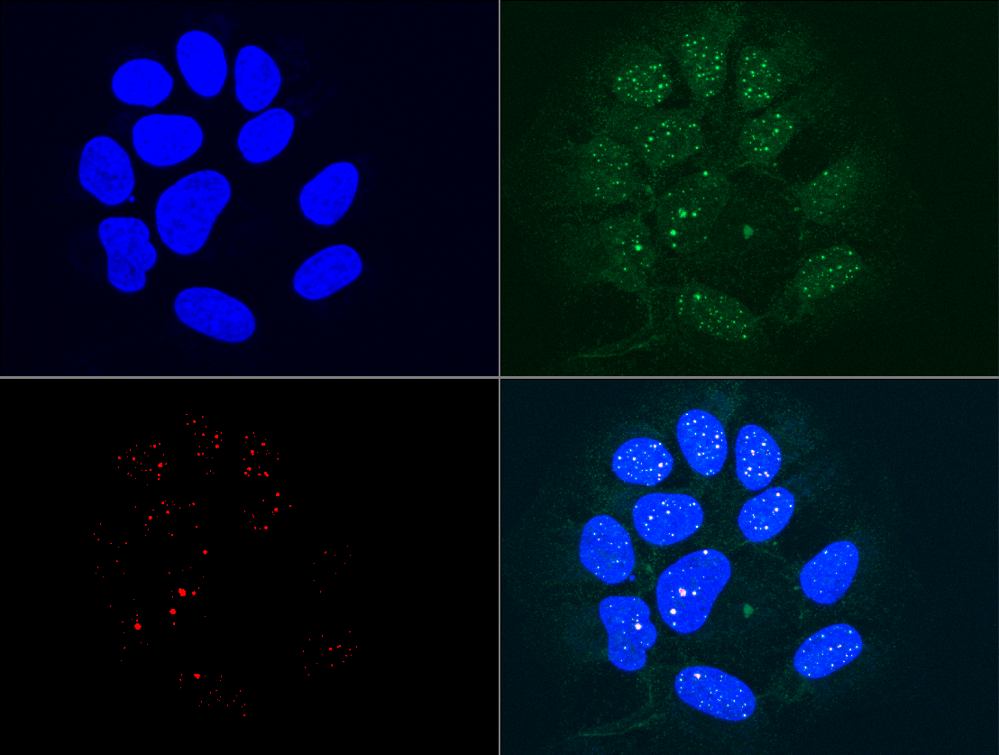

## Intellesis and Machine Learning

The ZEN software platform has various built-in image segmentation function. One of those tools is called ZEN Intellesis Trainable Segmentation, which is using machine-learning algorithms to segment images. More information can be found here:

[Intellesis Trainable Segmentation](https://www.zeiss.com/microscopy/int/website/landingpages/zen-intellesis.html)

***

***

### Key Features

* **Simple User Interface for Labelling and Training**

    * The tool aims for the non-expert by providing an “easy-to-use” interface
    * Not all “parameters” in machine-learning (an expert might expect) can be adjusted. They are hidden “on purpose” 

* **Integration into ZEN Measurement Framework**

    * As segmentation is only the required first step for subsequent measurements the integration into the actual measurement tools is key

* **Support for Multi-dimensional Datasets**

    * Intellesis, especially when considering the BioFormats option, can be used to segment any image even from non-Zeiss systems. 3D stacks, Tiles, Multi-Channel, …

### Technical Specfications

* Machine-Learning Tool for Pixel Classification powered by **Python
Dask, Scikit-Learn and Tensorflow** 
* Real **Multi-Channel Feature Extraction** – all channels will be used to segment a pixel
* **Class Segmentation** – hierarchical structures with independent segmentation per class
* **Engineered Feature Sets** and **Deep Feature Extraction** (GPU) and pre-trained networks
    * Engineered Default Feature Sets (CPU)
        * 25 or 33 Features
    * Neural Network (vgg19) Layers for Feature Extraction (GPU)
        * 64, 128 (red. 50) or 256 (red. 70) Features for 1st, 2nd or 3rd layer

* Pixel Classification by proven and established **Random Forrest Classifier**
* Option to **download** pre-trained DNNs for image segmentation
  * currently 3 pre-trained networks are available
  * import of external networks will come soon (see the [ANN Model Specification](docs/ann_model_specification.md))
* Post processing by **Conditional Random Fields** (CRF)
* Option to apply **confidence thresholds**
* IP-Functions for creating masks and **scripting integration** for advanced automation
* **Client-Server Architecture** (Zen Client - Python-Server) with using REST-API
* client-side tiling functionality to deal with large **mult-idimensional datasets**
* universal automated build pipeline for **ZeissPython** established and integrated in official Zeiss installer

### Workflows

#### Downloading Networks

Starting from the ZEN Blue 3.1 release the software allows to download pre-trained networks from ZEISS. Such networks are fully integrate into the ZEN Image Analysis framework and can be used the same way as the classical Intellesis models using pixle classification

#### Conditions of Use

*This pre-trained network was trained wizh "best-effort" on the availbale training data and is provided "as is" without warranty of any kind. The licensor assumes no responsibility for the functionality and fault-free condition of the pre-trained network under conditions which are not in the decribed scope. For details see the respective chapter in the Online Help / Documentation. By downloading I agree to the above terms.*

***

### Applications

ZEN can basically read any image data format using the BioFormats Import and Intellesis can therefore be used to segment **any multi-dimensional dataset** that can be imported into the software. Shown below are imaged segmented using Intellesis.

*Intellesis - Material Science Applications*

***

*Intellesis - Life Science Applications*

***

### Software

The actual segmentation service is completly written in Python and is using proven and established open-source machine-learning libraries to segment the images.

To be able to handle even large multi-dimensional datasets, the software has a built-in data manager that takes care of splitting nad distributing the workload depending on the availbale computation resources.

***

*Intellesis - DataFlow*

***

#### APEER Integration

Due to the fact that the SegmentationService is written completely in Python is can be used a module on the APEER platform. The complete SegmenationService is running inside a Linux-based docker container.

*APEER Workflow using the Intellesis SegmentationService as a module*

***

If you want to test this platform, register here:

[APEER Platform](https://www.apeer.com/app/#/home)

To read about the newest developments on APEER read the blog:

[APEER Blog](https://www.apeer.com/app/#/home)

***

## Scripts

### ZEN_Intellesis_Simple_Test.py

This simple script demonstrated the different possibilities to segment an image using a trained model. The result of such a segmentation is a mask image, which has either as many channels as the models has classes, or one channel containing a distinct label for every class.

*(top left) - raw image data data (top right) segmented image (bottom left) segmeneted with confidence threshold and (bottom right) probobility map image*

### Intellesis_Segmentation_Tool.py

*ZEN Intellesis Segmentation Tool*

***

The Intellesis Segmentation Tool allows you to automate and simplify the following tasks:

* Select a model to segment images
* Specify the desired output format for the mask image
* Optional Confidence Threshold that can be appied to mask image
* Optional Extraction of a specific singkle class
* Option to add the mask image to the original image
* Selection of output folder with file extension filter
* Option to segment all image iside a folder or only apply to active image

Beside this tool is is alos possible to run a segmenation using the ZEN built-in batch tool, which does not require this script but offers less addtional options.

### Intellesis_Segmentation_Tool_singleCH.py

*Intellesis Segmentation Tool Single Channel - Step 1*

***

*Intellesis Segmentation Tool Single Channel - Step 2*

***

The Intellesis Segmentation Tool Single Channel allows you to automate and simplify the following tasks:

* It uses the current active image as an input
* Specify the channel to be segmented and the model to be uses in step 1
* Specify the desired class (for the selected model) and other option in step 2
* Apply segementation to the selected channel
* Optionally add the mask to the original multi-channel image

Beside this tool is is alos possible to run a segmenation using the ZEN built-in batch tool, which does not require this script but offers less addtional options.

***

*Segmented green channel (bottom left)*