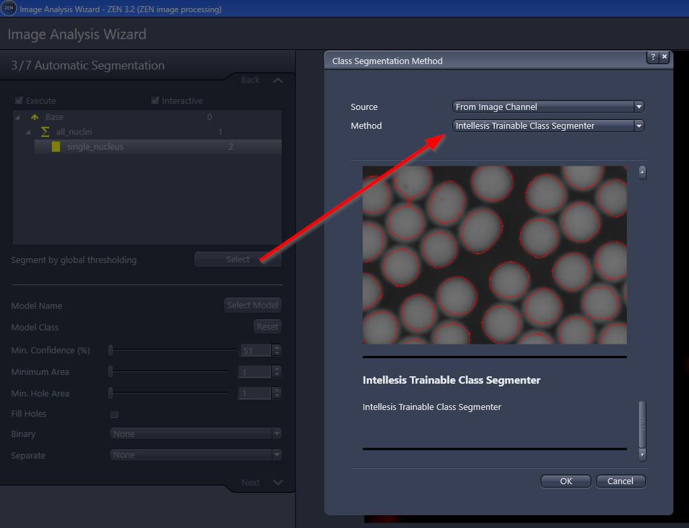
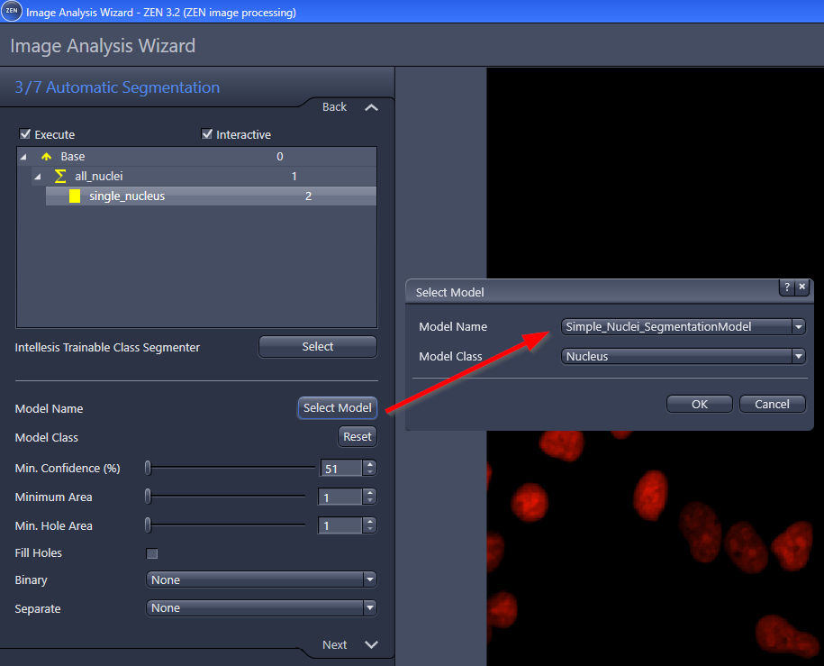

# Importing External Networks in ZEN

## Bringing ANNs and Intellesis together

Training artificial neural networks (ANN) to tackle semantic segmentation problems has become a very popular task and an increasing number of solutions has become available that require little technical understanding to train ANNs. Of course, this statement does not hold for models highly optimized for specific use cases where solving the problem at hand requires a high amount of experience, creativity and some “magic”. However, in many cases it is possible to achieve decent results with widely used ANN model architectures, a sufficient amount of data and enough compute power.

While about a decade ago solving computer vision tasks required an expert to design algorithms and understand the math behind them, ANNs and simple-to-use frameworks like [TensorFlow](https://www.tensorflow.org/) and [PyTorch](https://pytorch.org/) allow learning those algorithms from data and therefore can be treated as a black-box even achieving super-human performance in some cases. This simplicity and the high expressiveness of neural network models are presumably the reason that ANNs have become extremely popular and there is literally no way around this technology in research as well as industry. It should, however, be mentioned here that it is still extremely helpful to understand what happens behind the scenes.

### The challenges of deployment

While in research the focus mostly lies on training and evaluating models, deployment is a different issue that poses different challenges. Especially in microscopy there usually are not only captured small images but stacks of images, time series of images or tiled scenes that are stitched to one large image of multiple or even hundreds of gigabytes. The training process, in contrast, is typically performed on small image crops (e.g. 256 x 256) such that the data for the calculations fits into the GPU or main memory of the employed machine. Applying a trained model on considerably larger images as mentioned above brings about several pitfalls that need to be handled.

The [ZEN Intellesis](https://www.zeiss.com/microscopy/int/products/microscope-software/zen-intellesis-image-segmentation-by-deep-learning.html) infrastructure provides a solution for that problem. It applies a sophisticated tiling strategy that transforms multi-dimensional image captures – as they are generated by ZEISS microscopes – to image tiles of shape (height x width x color channels) where height and width are defined by the applied ANN model. Finally, it performs inference with the model and reassembles the resulting segmentation masks to fit the initially captured image. It therefore offers a solution to apply a trained ANN on large images without worrying too much about the required memory and the size of the image.

### czmodel – From TensorFlow to Intellesis

Starting with ZEN Blue 3.2 it will be possible to run prediction with custom segmentation models implemented in TensorFlow 2. To be compatible with the Intellesis infrastructure, a TensorFlow/Keras model has to comply with our specification and some meta data must be provided that is described in detail in the official ANN model specification in the project description of our **[czmodel package](https://pypi.org/project/czmodel/)**. This blog post introduces a python library called czmodel that offers a set of tools to easily convert a trained TensorFlow/Keras model to a CZMODEL file that can be directly loaded into ZEN Intellesis. Generating a CZMODEL file this way is just a matter of a few lines of code and can therefore easily be integrated into any training pipeline as well as custom Apeer modules.

Assuming that there is some kind of training pipeline in place that generates trained TensorFlow/Keras models as instances of `tensorflow.keras.Model`. For a simple example of such a pipeline see the attached Jupyter notebook (ready to be executed) in our **[Microsoft Azure Jupyter Notebook](https://notebooks.azure.com/sebastian-soyer/projects/czmodel)**. Note that the notebook is not to be understood as a best practice guide for training ANN models but rather illustrates the use of the **[czmodel](https://pypi.org/project/czmodel/)** library with a very simple model generation process that will usually be more sophisticated.

The entire `czmodel` package operates on so called `ModelSpec` objects that contain all information needed to convert a TensorFlow/Keras model to CZMODEL. Specifically, it contains the trained model itself and a metadata object called ´ModelMetadata´ that reflects the JSON metadata described in the **[ANN model specification](https://pypi.org/project/czmodel/)** as a python class.

Thus, the typical workflow of converting a TensorFlow/Keras model to CZMODEL is to create a `ModelMetadata` object, wrap it into a `ModelSpec` object together with the corresponding TensorFlow/Keras model and, finally, provide the ModelSpec object to the conversion function that generates the CZMODEL file.

The `czmodel` package supports three different ways to generate a CZMODEL.

#### Convert a loaded TensorFlow/Keras model to CZMODEL using a ModelSpec

This scenario reflects exactly the workflow described above. The ModelMetadata and ModelSpec objects for a loaded TensorFlow/Keras model named “model” are created as follows:

```python
from czmodel.model_metadata import ModelMetadata, ModelSpec
from czmodel.convert import convert_from_model_spec

# Create the model metadata
model_metadata = ModelMetadata.from_params(name='DNNModelFromKeras',
                         color_handling='ConvertToMonochrome',
                         pixel_type='Gray16',
                         classes=["Background", "Interesting Object", "Foreground"],
                         border_size=90,
                         license_file="C:\\some\\path\\to\\a\\LICENSE.txt")

# Create the model spec
model_spec = ModelSpec(model=model, model_metadata=model_metadata)

# Convert the model
convert_from_model_spec(model_spec, 'Output path', 'Model Name')
```

#### Convert a SavedModel on disk to CZMODEL using a ModelSpec

In this case it is assumed that the TensorFlow/Keras model does not to reside in the main memory but on disk in the SavedModel format. Let “path” be the path to the SavedModel folder. The same procedure as shown above can be applied to loaded models but instantiate the ModelSpec object with the path of the model instead of the loaded model:

```python
model_spec = ModelSpec(model=path, model_metadata=model_metadata)
```

The `czmodel` library will automatically load the model from the given path before wrapping it into a CZMODEL.

Convert a SavedModel on disk to CZMODEL by providing a JSON metadata file
This functionality replicates the import functionality of ZEN Intellesis to load models via a **[JSON specification](https://pypi.org/project/czmodel/)**. If models should e.g. be exchanged with third parties, it is usually easier to deliver CZMODEL files that contain everything needed to run the model within Intellesis than exchanging JSON files with the corresponding SavedModel folders that would, nonetheless, need to be bundled another way.
The `czmodel` library provides a simple conversion routine that does all this in one line:

```python
from czmodel.convert import convert_from_json_spec

convert_from_json_spec('Path to JSON file', 'Output path', 'Model Name')
```

Note that the path to the model is implicitly defined by the provided JSON file.

#### Adding pre-processing and setting the tile size

Most trained models require some kind of pre-processing (e.g. normalization/standardization) to transform the input data to the distribution the model was actually trained on. The Intellesis inference engine requires this to be part of the model while – depending on the training infrastructure - this is not necessarily the case during training.

All conversion functions in the `czmodel` library wrap the provided model into a deployment model if pre-processing is applied or the spatial dimensions should be reset. They additionally accept a list of TensorFlow/Keras layers as a `preprocessing` argument that will be prepended to the provided model. Additionally, setting the parameter `spatial_dims` allows to redefine the spatial dimensions of the expected model inputs that implicitly defines the size of the tiles provided to the inference engine. Note that this is only possible for models that are invariant w.r.t to the spatial dimensions.

While the `czmodel.util.preprocessing` module provides a set of useful pre-processing layers, any TensorFlow/Keras layer can in theory be used for pre-processing. The following call generates a CZMODEL from the above defined ModelSpec object, appends a RgbToBgr pre-processing layer to transform the input images to a different color space and sets the expected size of the input images to 512 x 512:

```python
from czmodel.util.preprocessing import RgbToBgr
convert_from_model_spec(model_spec,
        'Output path',
        'Model Name',
        Preprocessing= RgbToBgr(),
        spatial_dims=(512, 512))
```

#### Remarks

The current implementation of `czmodel` heavily relies on the SavedModel import/export functionality in TensorFlow 2. We therefore recommend to always use the latest version of TensorFlow 2 compatible to `czmodel` as there are continuously released improvements and bugfixes in the TensorFlow code base.

---

## Jupyter Notebook - Train a simple network to be imported in ZEN

This section contains a Jupyter notebook demonstrating the usage of our **[czmodel package](https://pypi.org/project/czmodel/)** inside a simple training pipeline. The focus is on explaining the functionalities of the package, not to do proper training of a network.

Link to Juypter notebook: **[train_simple_TF2_segmentation_model.ipynb](../docs/demo_notebook_czmodel/train_simple_TF2_segmentation_model.ipynb)**

## Train_simple_TF2_segmentation_model.ipynb

This is basically the same jupyter notebook as the one from above hosted on Azure (in case Azure cannot be accessed etc.)

```python
# Install czmodel and dependencies
#! pip install --upgrade pip
#! pip install czmodel
```

```python
# this can be used to switch on/off warnings
import warnings
warnings.filterwarnings('ignore')
warnings.simplefilter('ignore')
```

### Simple TF2 + Keras model for segmentation (to detect cell nuclei)

This notebook the entire workflow of training an ANN with **[TensorFlow 2](https://www.tensorflow.org/)** using the Keras API and exporting the trained model to the **[czmodel format](https://pypi.org/project/czmodel/)** to be ready for use within the **[Intellesis](https://www.zeiss.com/microscopy/int/products/microscope-software/zen-intellesis-image-segmentation-by-deep-learning.html)** infrastructure.

- The trained model is rather simple (for demo purposed) and trained on a small test data set.
- **Therefore, this notebook is meant to be understood as a guide for exporting trained models**
- **The notebook does not show how train a model correctly.**

```python
# required imports to train a simple TF2 + Keras model for segmentation and package it as CZMODEL
# the CZMODEL can be then imported in ZEN and used for segmentation and image analysis workflows

# general imports
import os
import tensorflow as tf
import numpy as np

# those functions are provided by the PyPi package called czmodel (by ZEISS)
from czmodel.util.preprocessing import PerImageStandardization, add_preprocessing_layers
from czmodel.model_metadata import ModelMetadata, ModelSpec
from czmodel import convert_from_model_spec, convert_from_json_spec
```

```python
# Optional: suppress TF warnings
import logging
logging.getLogger("tensorflow").setLevel(logging.ERROR)
print(tf.version.GIT_VERSION, tf.__version__)
```

    v2.0.0-69-g765ac8d16e 2.0.1

### Training Pipeline

This section describes a simple training procedure that creates a trained Keras model.

- Therefore, it only represents the custom training procedure
- Such procedure will vary from case to case and will contain more sophisticated ways to generate an optimized Keras model

```python
# Define the parameters for loading the training data

# place the original *.png images here
IMAGES_FOLDER = 'data/nuclei_images/'

# place the respective label *.png images here
# masks images have one channel (0=background and 1=nucleus)
MASKS_FOLDER = 'data/nuclei_masks/'

# define the number of channels
# this means using a grayscale image with one channel only
CHANNELS = 1
```

```python
# Read the images
# This part contains the logic to read pairs of images and label masks for training !

# the the sample images
sample_images = sorted([os.path.join(IMAGES_FOLDER, f) for f in os.listdir(IMAGES_FOLDER)
                        if os.path.isfile(os.path.join(IMAGES_FOLDER, f))])

# get the maks
sample_masks = sorted([os.path.join(MASKS_FOLDER, f) for f in os.listdir(MASKS_FOLDER)
                       if os.path.isfile(os.path.join(MASKS_FOLDER, f))])

# load images as numpy arrays
images_loaded = np.asarray([tf.image.decode_image(tf.io.read_file(sample_path), channels=CHANNELS).numpy()
                            for sample_path in sample_images])

# load labels as numpy arrays
masks_loaded = np.asarray([tf.one_hot(tf.image.decode_image(tf.io.read_file(sample_path), channels=1)[...,0], depth=2).numpy()
                           for sample_path in sample_masks])
```

Remark: For details see **[tf.one_hot](https://www.tensorflow.org/api_docs/python/tf/one_hot)**

`tf.one_hot creates X channels from X labels: 1 => [0.0, 1.0], 0 => [1.0, 0.0]`

#### Define a simple model

This part defines a simple Keras model with two convolutional layers and softmax activation at the output node. It is also possible to add pre.processing layers to the model here.

In order to make the model robust to input scaling we standardize each image before training with the PerImageStandardization layer provided by the `czmodel` package.

```python
# Define simple Keras model with two convolutional layers and softmax activation at the output node

model = tf.keras.models.Sequential([PerImageStandardization(input_shape=(None, None, 1)),
                                    tf.keras.layers.Conv2D(16, 3, padding='same'),
                                    tf.keras.layers.Conv2D(2, 1, activation='softmax', padding='same')])

# compile the model
model.compile(optimizer='adam', loss='categorical_crossentropy', metrics=['categorical_accuracy'])
```

#### Fit the model to the loaded data

This part fits the model to the loaded data and evaluates it on the training data. In this test example we do not care about an actual evaluation of the model using validation and test data sets.

```python
# define number of training epochs
num_epochs = 10

# fit the model to the data
model.fit(images_loaded, masks_loaded,
          batch_size=32,
          epochs=num_epochs)

# get the loss and acuary values
loss, accuracy = model.evaluate(images_loaded, masks_loaded)

# show the final accuracy achieved
print("The model achieves {}% accuracy on the training data.".format(accuracy * 100))
```

    Train on 200 samples
    Epoch 1/10
    200/200 [==============================] - 2s 8ms/sample - loss: 0.7081 - categorical_accuracy: 0.2822
    Epoch 2/10
    200/200 [==============================] - 1s 4ms/sample - loss: 0.6378 - categorical_accuracy: 0.8523
    Epoch 3/10
    200/200 [==============================] - 1s 4ms/sample - loss: 0.5944 - categorical_accuracy: 0.8575
    Epoch 4/10
    200/200 [==============================] - 1s 4ms/sample - loss: 0.5687 - categorical_accuracy: 0.8590
    Epoch 5/10
    200/200 [==============================] - 1s 4ms/sample - loss: 0.5493 - categorical_accuracy: 0.8602
    Epoch 6/10
    200/200 [==============================] - 1s 4ms/sample - loss: 0.5329 - categorical_accuracy: 0.8617
    Epoch 7/10
    200/200 [==============================] - 1s 4ms/sample - loss: 0.5162 - categorical_accuracy: 0.8638
    Epoch 8/10
    200/200 [==============================] - 1s 4ms/sample - loss: 0.4985 - categorical_accuracy: 0.8668
    Epoch 9/10
    200/200 [==============================] - 1s 4ms/sample - loss: 0.4811 - categorical_accuracy: 0.8700
    Epoch 10/10
    200/200 [==============================] - 1s 4ms/sample - loss: 0.4635 - categorical_accuracy: 0.8732
    200/1 [================================] - 0s 2ms/sample - loss: 0.4168 - categorical_accuracy: 0.8747
    The model achieves 87.46746778488159% accuracy on the training data.

### Create a CZModel from the trained Keras model

In this section we export the trained model to the CZModel format using the czmodel library and some additional meta data all possible parameter choices are described in the **[ANN model specification](https://pypi.org/project/czmodel/)**.

#### Define Meta-Data

We first define the meta-data needed to run the model within the Intellesis infrastructure. The `czmodel` package offers a named tuple `ModelMetadata` that allows to either parse as JSON file as described or to directly specify the parameters as shown below.

#### Create a Model Specification Object

The export functions provided by the `czmodel` package expect a `ModelSpec` tuple that features the Keras model to be exported and the corresponding model metadata.

Therefore, we wrap our model and the `model_metadata` instance into a `ModelSpec` object.

```python
# Define the model metadata
model_metadata = ModelMetadata.from_params(name='Simple_Nuclei_SegmentationModel',
                                           color_handling='ConvertToMonochrome',
                                           pixel_type='Gray16',
                                           classes=["Background", "Nucleus"],
                                           border_size=8)


# Create a model specification object used for conversion
model_spec = ModelSpec(model=model, model_metadata=model_metadata)

# Define dimensions - ZEN Intellesis requires fully defined spatial dimensions.
# This is the tile size used by the ZEN TilingClient to pass a. image to the segmentation service.

# Important: The tile size has to be chosen s.t. inference is possible with the minimum hardware requirements of Intellesis
spatial_dims = 1024, 1024  # Optional: Define target spatial dimensions of the model for inference.
```

#### Perform model export into \*.czmodel file format

The `czmodel` library offers two functions to perform the actual export.

- `convert_from_json_spec` allows to provide a JSON file with all information to convert a model in SavedModel format on disk to a `.czmodel` file that can be loaded with ZEN.
- `convert_from_model_spec` expects a `ModelSpec` object, an output path and name and optionally target spatial dimensions for the expected input of the exported model. From this information it creates a `.czmodel` file containing the specified model.

```python
convert_from_model_spec(model_spec=model_spec,
                        output_path=folder_to_store_czmodel,
                        output_name=name_of_the_model,
                        spatial_dims=spatial_dims)
```

```python
convert_from_model_spec(model_spec=model_spec,
                        output_path='./czmodel_output',
                        output_name='simple_nuclei_segmodel',
                        spatial_dims=spatial_dims)

# In the example above there will be a ""./czmodel_output/simple_nuclei_segmodel.czmodel" file saved on disk.
```

### Remarks

The generated .czmodel file can be directly loaded into ZEN Intellesis to perform segmentation tasks with the trained model.
If there is already a trained model in SavedModel format present on disk, it can also be converted by providing a meta-data JSON file as described in the **[ANN Specification](https://pypi.org/project/czmodel/)**.

The following JSON document describes the same meta-data applied in the use case above:

```json
{
  "BorderSize": 8,
  "ColorHandling": "ConvertToMonochrome",
  "PixelType": "Gray16",
  "Classes": ["Background", "Nuclei"],
  "ModelPath": "saved_tf2_model_output"
}
```

This information can be copied to a file e.g. in the current working directory `./model_spec.json` that also contains the trained model in SavedModel format e.g. generated by the following line:

```python
# save the trained TF2.SavedModel as a folder structure
# The folder + the JSON file can be also used to import the model in ZEN

model.save('./saved_tf2_model_output_dims_unset/')
add_preprocessing_layers(model, layers=None, spatial_dims=spatial_dims).save('./saved_tf2_model_output/')
```

The CZMODEL file (which is essentially a zip file) contains:

- **model guid file**: modelid=e47aabbd-8269-439c-b142-78feec2ed2dd

- **model file**: modelid=e47aabbd-8269-439c-b142-78feec2ed2dd.model

- **model description**: e47aabbd-8269-439c-b142-78feec2ed2dd.xml

**Example of a model XML description**


To import the newly created model just use the **`Import`** function of the Intellesis Trainable Segmentation module in ZEN.


Select the **`simple_nuclei_segmodel.czmodel`** file and press the **`Open`** button.


Use the IP-function **`Segmentation`** to segment an image using the imported CZMODEL (containing the trained network).


To use the trained model to analyse an image there are two main options

1. directly create an Image Analysis Setting based on the model (no class hierarchy, but very simple)
2. assign the trained model to s specific class inside a customized image analysis setting (shown below)

The crucial step (when not using option 1) is the Select the correct **`Class Segmentation Method`** inside the Image Analysis Wizard.



Use the **`Select Model`** function to assign the trained model and the actual **class** (from the trained model) of interest to assign the model / class to the respective object inside the image analysis setting.



Now the trained model will be used to segment the image. The built-in ZEN Tiling Client automatically to chunk the image and deal with complex dimensions, like Use the **`Scenes`** etc.

Additional Porst-Processing option, incl. a Minimum Confidence Threshold can be applied to further refine the results.


Finally, the model can be loaded into ZEN by using the **Import** function on the **JSON file**.

If the model is supposed to be provided to other parties it is usually easier to exchange .czmodel files instead of SavedModel directories with corresponding JSON meta-data files.

The `czmodel` library also provides a `convert_from_json_spec` function that accepts the above mentioned JSON file and creates a CZModel:

```python
# This is an additional way how to create a CZMODEL from a saved TF2 model on disk + JSON file.
# The currently recommended way to to create the CZMODEL directly by using czmodel.convert_from_model_spec
# the path to the TF2.SavedModel folder is defined in the JSON shown above

convert_from_json_spec(model_spec_path='model_spec_dims_unset.json',
                       output_path='model_from_json',
                       output_name = 'simple_nuclei_segmodel_from_json',
                       spatial_dims=spatial_dims)
```

- the path to the saved model folder is defined in the JSON shown above

- **Remark: Due a TF 2.1 bug reloading a model does currently not work correctly.** See issue: https://github.com/tensorflow/tensorflow/issues/37158. This works with TF 2.0 and will be fixed again with TF 2.2. We currently do not have any information if there will be released a patch for TF 2.1 that fixes the issue there.

Use the commands below from a terminal to present the notebook as a slideshow.

`jupyter nbconvert train_simple_TF2_segmentation_model.ipynb --to slides --post serve --SlidesExporter.reveal_theme=serif --SlidesExporter.reveal_scroll=True --SlidesExporter.reveal_transition=none`

Or install the [RISE Extension](https://rise.readthedocs.io/en/stable/) to display a a slideshow directly from within the notebook
