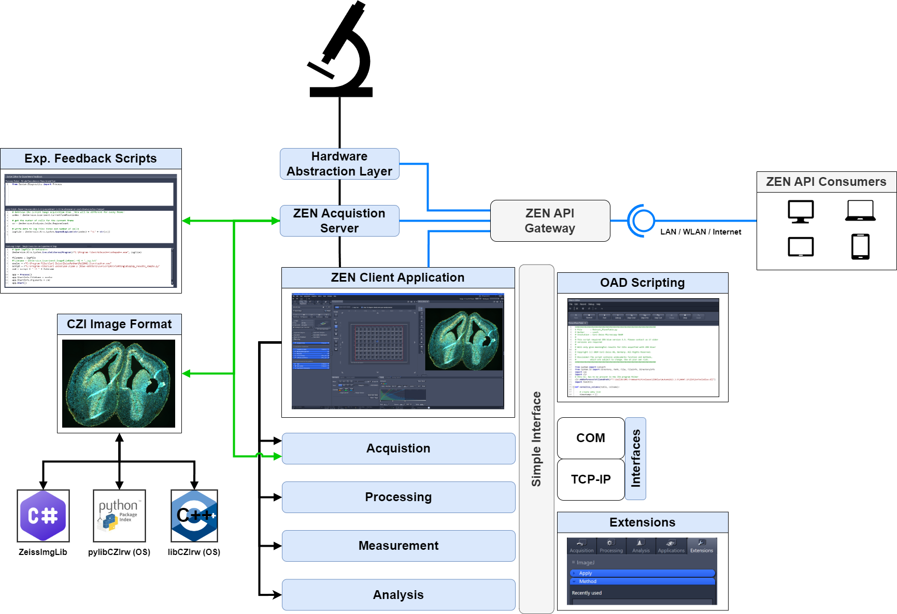
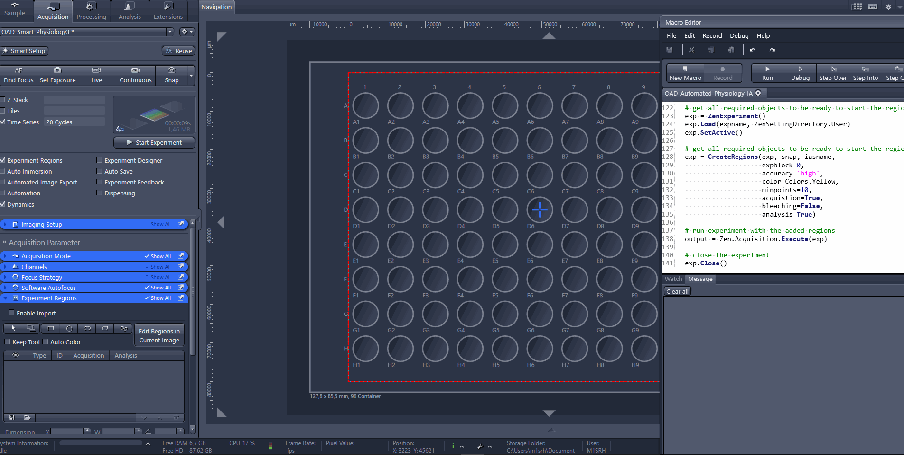
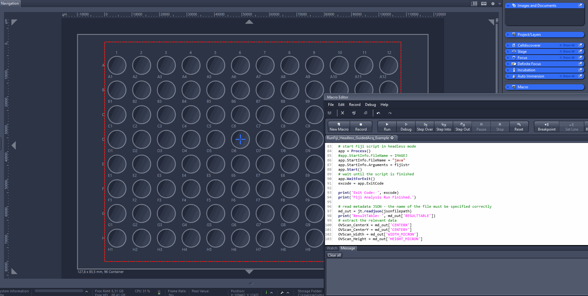

- [Open Application Development (OAD)](#open-application-development-oad)
  - [OAD - General Concept and Key Features](#oad---general-concept-and-key-features)
  - [Links and References](#links-and-references)
- [Disclaimer](#disclaimer)

# Open Application Development (OAD)

ZEN Blue is an open, flexible and powerful image acquisition platform that allows controlling a wide range of microscopes systems. Additionally it offers various tools to automate microscopy workflows including acquisition, image analysis and image processing tasks.

In order to fulfill the request for automation the ZEN Blue platform offers various features and options, which are combined inside a concept called Open Application Development (OAD).

Its main components are:

- **CZI image data format and its APIs**
- **Python Scripting (OAD Simple API)**
- **ZEN API Contraol ZEN from the outside**
- **Interfaces to ZEN (TCP-IP, COM, Extensions)**
- **Experiment Feedback - Adaptive Acquisition with Online Image Analysis**

---

## OAD - General Concept and Key Features

- **Open Application Development** (OAD) uses powerful **Python Scripts** to **simplify, customize** and **automate** your workflows.

- **Analyze** and **Exchange** data with applications like **Fiji, Python, Knime, CellProfiler, Icy, MATLAB, Excel** and …

- API for reading and writing CZI image data using custom software

  - **ZeissImgLib (.NET)** to be used on Windows-based systems
  - **libCZI (C++)** and **pylibCZIrw (python)** for cross-platform applications
  - **BioFormats (CZIReader)** allow easy access to CZI files from many external applications using the BioFormats library

- **BioFormats Import** as a module inside ZEN Blue as well as **OME-TIFF Export**

- Create **“smart”** experiments with **Experiment Feedback** and modify the acquisition **On-the-fly** based on **Online Image Analysis** and **External Inputs**
- Use "Guided Acquisition" and "Automated Photomanipulation" modules in ZEN

---

_ZEN Interfaces_

---

_Automated Dynamics_

---

_External Software_

---

## Links and References

- [CZI Image Data Format](http://www.zeiss.com/czi) for microscopes

- [libczi](https://github.com/ZEISS/libczi): Open Source Cross-Platform API to read and write CZI

- [pylibCZIrw](https://pypi.org/project/pylibCZIrw/): Open Source Cross-Platform API to read and write CZI from Python (based on libCZI C++) ([Source Code](https://github.com/ZEISS/pylibczirw))

- [Open Application Development](https://github.com/zeiss-microscopy/OAD)

- [OME-TIFF format](http://www.openmicroscopy.org/site/support/file-formats/ome-tiff)

---

# Disclaimer

This is an collection of tools and scripts that is free to use for everybody.
Carl Zeiss Microscopy GmbH's ZEN software undertakes no warranty concerning the use of those scripts, image analysis settings and ZEN experiments. Use them on your own risk.

Additionally Carl Zeiss Microscopy GmbH's ZEN software allows connection and usage to the third party software packages.
Therefore Carl Zeiss Microscopy GmbH undertakes no warranty concerning those software packages, makes no representation that they will work on your system and/or hardware and will not be liable for any damages caused by the use of this extension.

By using any of those examples you agree to this disclaimer.

Version: 2024.11.26

Copyright (c) 2024 Carl Zeiss AG, Germany. All Rights Reserved.
