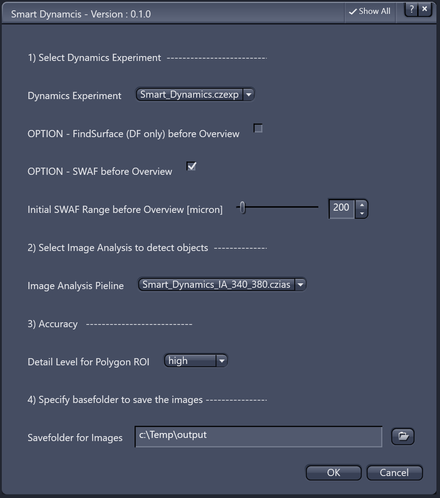

## Hardware and Acquisition

### FindSurface_SWAF_ActiveExp.py

This script is intended to be placed as a action button inside the ZEN menu bar especially when using a Celldiscoverer 7 system. The idea here is to combine the hard-based focus with the software focus to store the final z-value (where something should be in focus) inside the hardware focus in order to be able to relocate to that value (relative to the sample carrier surface) easily without bleaching.

The script does the following things:

* run **FindSurface** to move to the surface of the sample carrier, which is not in all cases exactly the focal plane the user wants to see

* execute a **Software Autofocus** (SWAF) based on the resulting z-position from **FindSurface**.

* The result of the **SWAF** will be stored as an offset inside the DF.2 and be recalled anytime via **RecallFocus**

### Smart_Dynamics.py

ZEN Blue offers the possibility to measure the intensity ratio etc. of objects during a running acquisition. Typically the ROIs (where the intensities will be measured) will be created manually.

For some applications or workflows in can be very beneficial to let an Image Analysis setting create those ROIs automatically be segmenting the objects before the start of the experiment.

The user has to define the following parameters:

* ZEN Experiment wit Dynamics activated (no positions or tiles)
* Option to run a FindSurface using the DF.2 (if available) to find the sample surface
* Option to run a software autofocus before the actual experiment starts
* the Image Analysis setting (*.czias) to segment the actual cells or objects
  * classical threshold as well as machine-learning based segmentation (PixelClassifier or Deep Neural Networks) can be used
* level of accuracy for the creation of the polygons to outline objects
* folder to save the results including the data tables from the image analysis

## Disclaimer

> :warning: **This tutorial and the related scripts are free to use for everybody. Use it on your own risk. Especially be aware of the fact that automated stage movements might damage hardware if the system is not setup properly. Please check everything in simulation mode first!**
>
> Carl Zeiss Microscopy GmbH's ZEN software allows connection to the third party software, Python. Therefore Carl Zeiss Microscopy GmbH undertakes no warranty concerning Python, makes no representation that Python will work on your hardware, and will not be liable for any damages caused by the use of this extension. By running this example you agree to this disclaimer.
