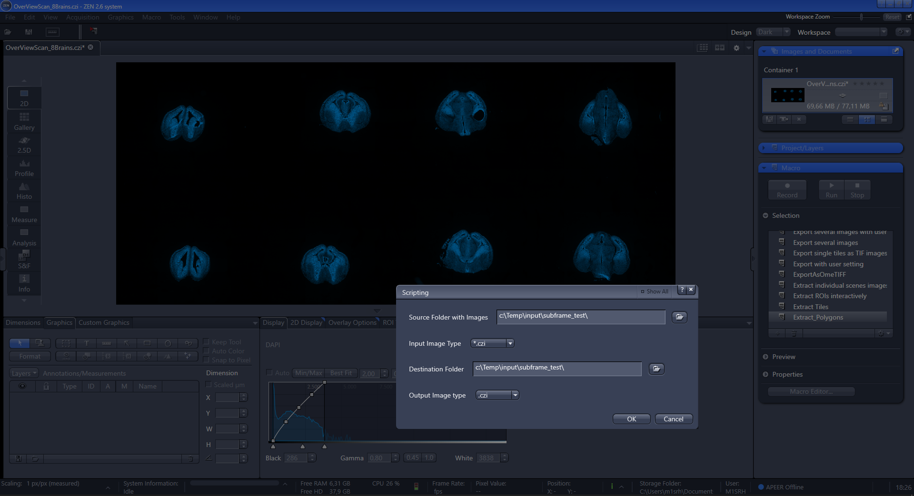
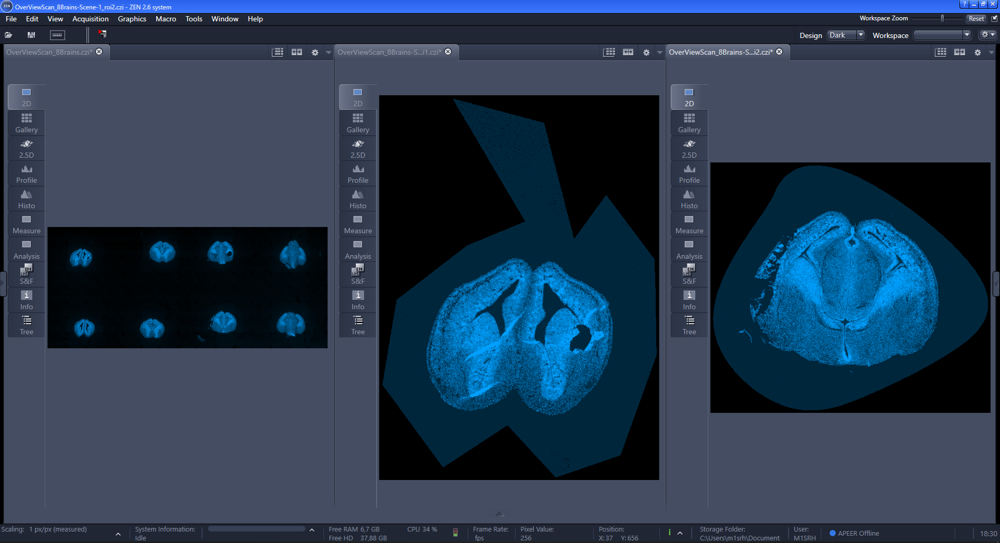
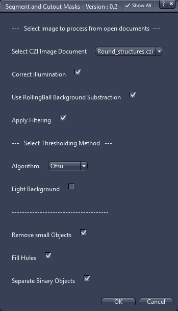

## Image Processing

### Extract_Polygons.py

This script will open all files inside a folder and do the following tasks:

* ask user to drwas polygon-based regions per image and per scenec
* save the subimages inside the specified folder as individual images

***

*Extract Polygon - Specify Input and Output Folder*

***

*Original image and two subimages created based on a polygon and spline region*

## segment_and_cutout_masks.py

This script will run a processing pipline on an image and do the following tasks:

* correct for uneven illumination using a highpass filter
* apply rolling ball background subtraction
* apply filtering
* apply an automatic threshold
* remove small objects from binary mask
* separate binary objects
* use mask to cutout part from the original image

To modify and adapt the actual parameters please edit thge script.

***

*Segment and Cutout Masks - Select Active Image*
