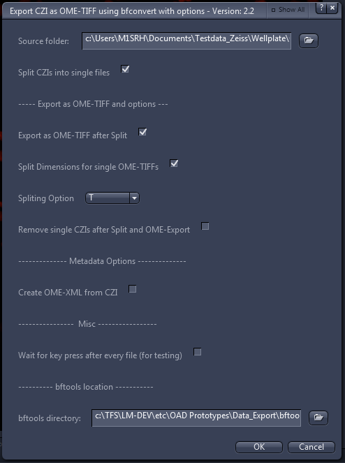
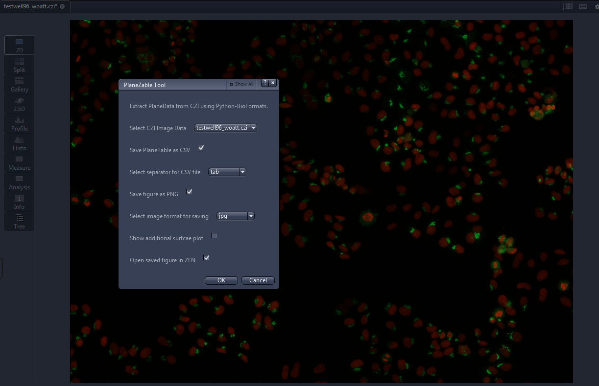
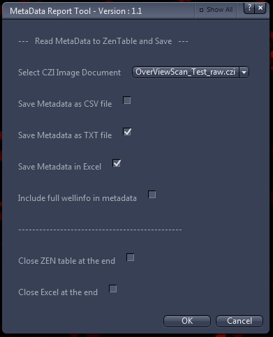
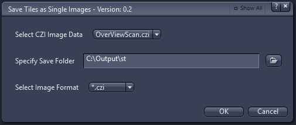
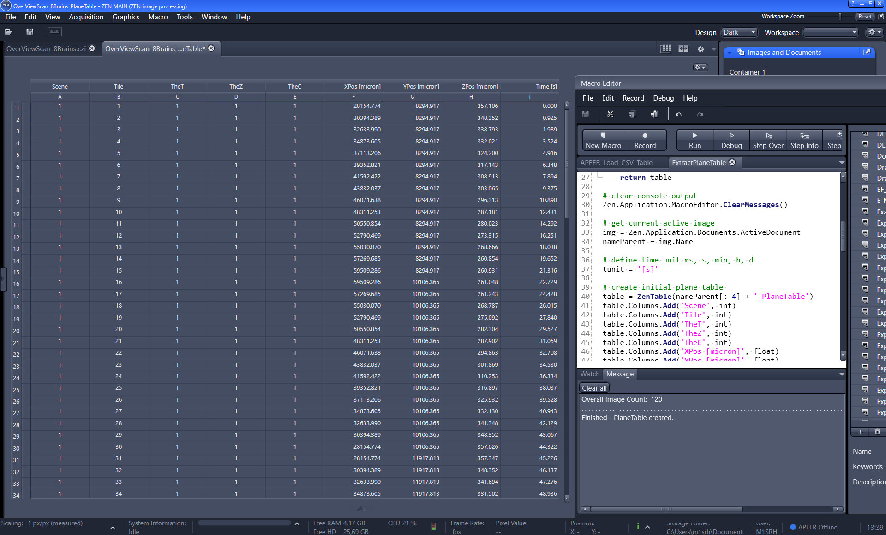
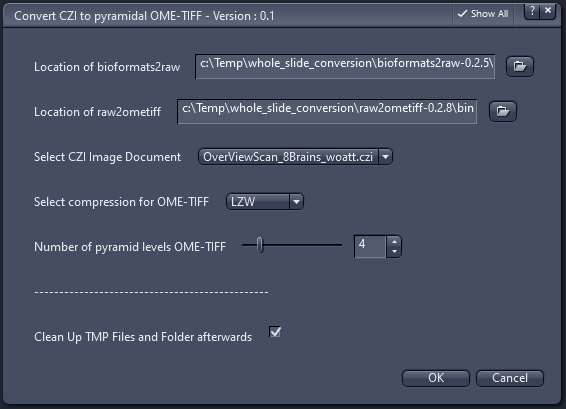
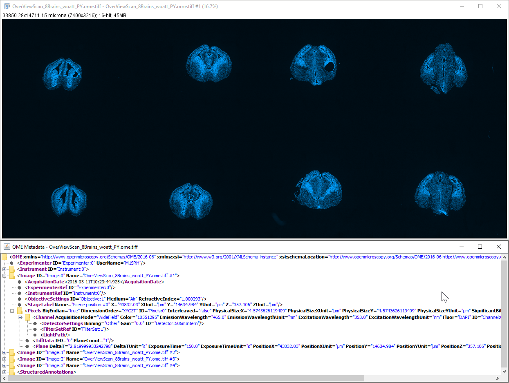

- [Data Tools](#data-tools)
  - [Batch_Export_OME_TIFF_XML_bfconvert_final.py](#batch_export_ome_tiff_xml_bfconvert_finalpy)
  - [Display_ZSurface_BF_Python.py](#display_zsurface_bf_pythonpy)
  - [Metadata_Report_Tool.py](#metadata_report_toolpy)
  - [SaveSingeTiles_to_Folder.py](#savesingetiles_to_folderpy)
  - [DramaticZoom.py](#dramaticzoompy)
  - [ExtractPlaneTable.py](#extractplanetablepy)
  - [convert2pyramidal_OMETIFF.py](#convert2pyramidal_ometiffpy)

## Data Tools

Collection of tools that deal with various aspects of image metadata. Some require additional software to create the shwos graphs.

### Batch_Export_OME_TIFF_XML_bfconvert_final.py

* **This tool allows to split and export CZI files to OME-TIFF files.**
* **Has the additional option to create OME-XML files.**
* **It is using the BioFormats command line tools which can be found here:**

[BioFormat Commandline Tools](http://www.openmicroscopy.org/site/support/bio-formats5.5/users/comlinetools/index.html)

***



***

### Display_ZSurface_BF_Python.py

The main idea here is to acquire an image data set and extract the **PlaneData** from the metadata to display those using python tools.
Since python-bioformats does not support the new multi-resolution interface of BioFormat's CZIReader for reading images containing an image pyramid, its is recommend to use BioFormats =< 5.1.10, if the data contains an image pyramid. The ZEN script will call a batch script that will call the respective scripts that will do the plotting.

The batch script showZsurface.bat can be also used directly from the command line using:

```bash
C:\mydir>showZsurface.bat path_to_czifile True tab True png True
```

Additionally there is Jupyter Notebook exploring this tool without using ZEN. It can be found here:

[DisplayZSurface Jupyter Notebook](https://github.com/zeiss-microscopy/OAD/blob/master/notebooks/DisplayZsurface/Display_Z-Surface_from_Image.ipynb)

***



***

This shows the actual surface of a 96 wellplate, where one position was recorded per well.

***


***

Optionally it is possible to also display the surface in 3D.


The **PlaneData** can be also saved inside a CSV table.

***


***

### Metadata_Report_Tool.py

The tools extracts all important metadata and:

- **displays them as a ZenTable directly inside ZEN Blue.**
- **saves it as CSV or TXT file.**
- **opens Excel to fill in the metadata into a sheet.**



***

### SaveSingeTiles_to_Folder.py

The tools extracts all single tiles from an tile image:

- **select the image to be split from the active documents**
- **specify the desired output folder**
- **select the desired output format for the single tile**



***

### DramaticZoom.py

This scripts creates a "zoom movie" for a user-defined region:

- **Macro to create a zoom-in or zoom-out movie**
- **Draw a region around the area you want to focus on. Any of the solid-line shapes, but not the dotted-line ROI**
- **A window will pop up asking for some user input, and then it will create a movie from the entire image to the region you selected**
- **Final output has the aspect ratio of the entire image (or scene, if a multi-scene file) and contains the entire drawn ROI.**
- **The most zoomed-in frame will be at native resolution, all other images are downsampled**

The tool was kindly provided by Sara McArdle from the La Jolla Institute for Immunology - LJI Microscopy Core.

***

### ExtractPlaneTable.py

This scripts creates a table with all indices and XYZ coordinates for every tile of the active CZI image.
In order to run the script one needs to place the [ZenTools.dll](/Scripts/DLLs/zenblue_33/ZenTools.dll) inside the ZEN program folder



***

### convert2pyramidal_OMETIFF.py

This script can be used to convert a CZI into an pyramidal OME-TIFF. Only LZW compression is currently supported. For more information see:

[bioformats2raw](https://github.com/glencoesoftware/bioformats2raw)
[raw2ometiff](https://github.com/glencoesoftware/raw2ometiff)




