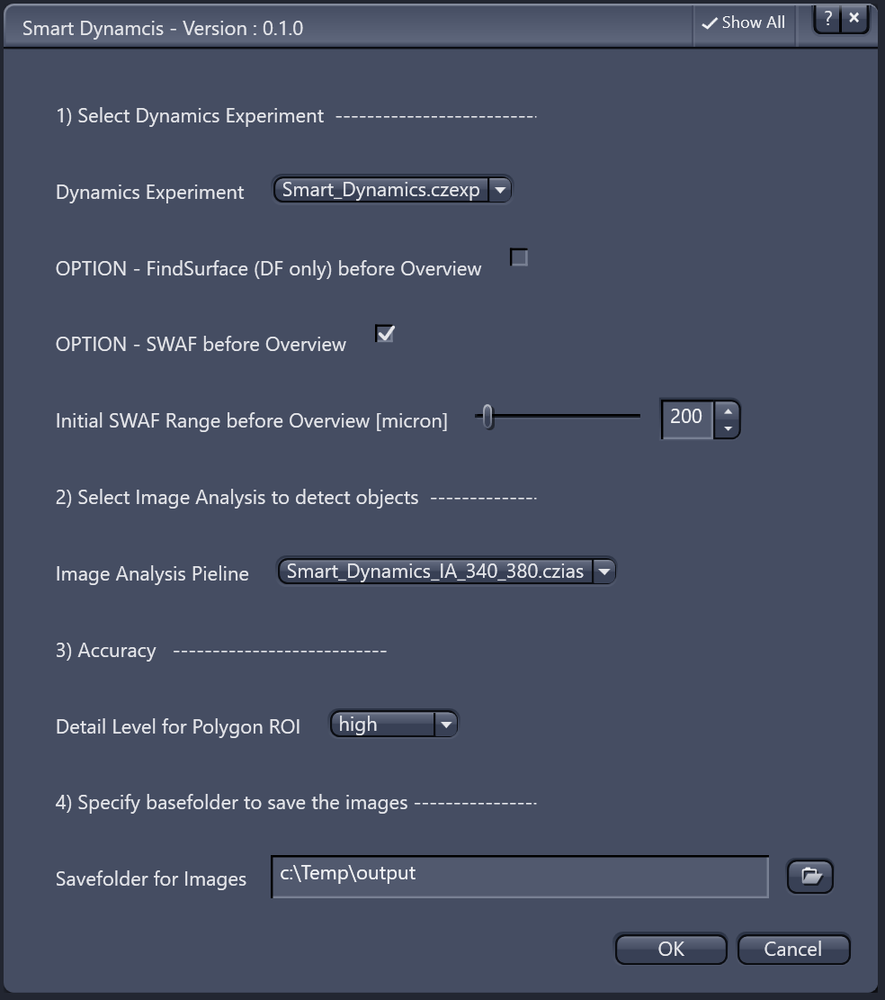
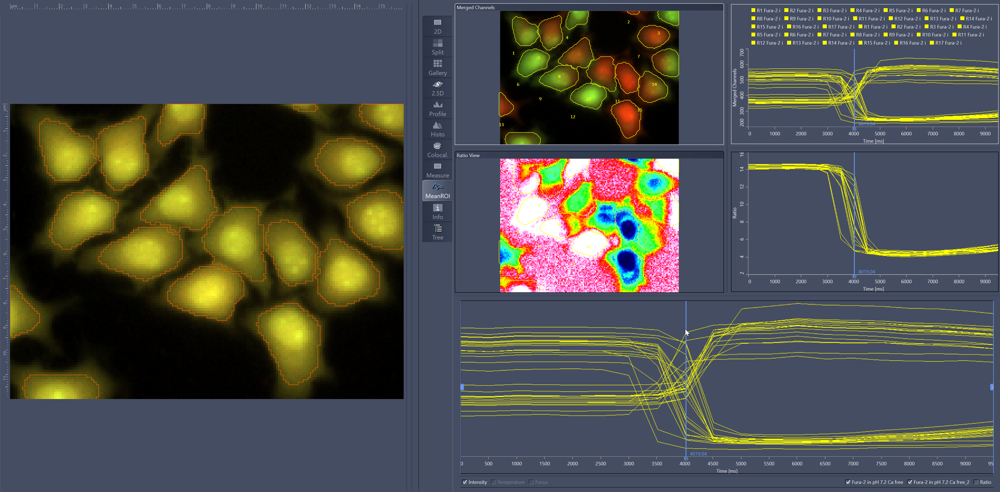
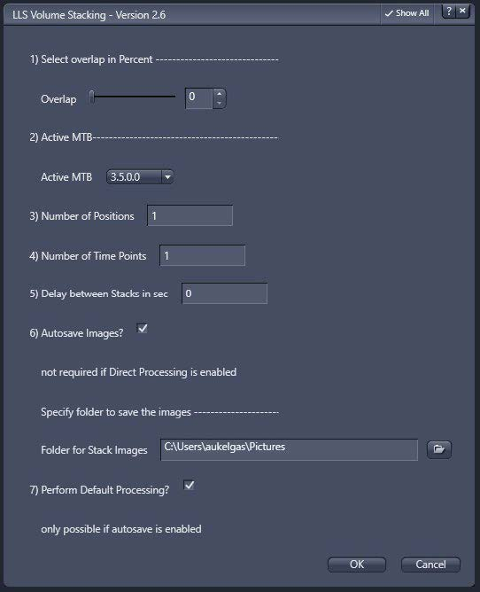
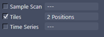
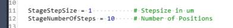
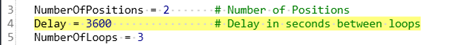
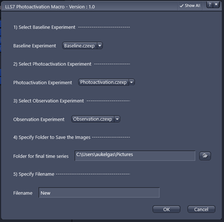

- [Hardware and Acquisition](#hardware-and-acquisition)
  - [FindSurface\_SWAF\_ActiveExp](#findsurface_swaf_activeexp)
  - [Smart\_Dynamics](#smart_dynamics)
  - [Lattice Light Sheet 7 Scripts](#lattice-light-sheet-7-scripts)
    - [LLS7\_VolumeStacking](#lls7_volumestacking)
    - [Fuse Volumes](#fuse-volumes)
    - [Batch Create Subset](#batch-create-subset)
    - [Batch Processing for "Split Scenes" Files](#batch-processing-for-split-scenes-files)
    - [Add Position](#add-position)
    - [Clear Positions](#clear-positions)
    - [MultiPosition](#multiposition)
    - [Position Time Series 1](#position-time-series-1)
    - [Position Time Series 2](#position-time-series-2)
    - [Position Time Series 3](#position-time-series-3)
    - [Photoactivation](#photoactivation)
    - [Extract Incubation Information](#extract-incubation-information)
  - [Disclaimer](#disclaimer)

# Hardware and Acquisition

## FindSurface_SWAF_ActiveExp

This script is intended to be placed as a action button inside the ZEN menu bar especially when using a Celldiscoverer 7 system. The idea here is to combine the hard-based focus with the software focus to store the final z-value (where something should be in focus) inside the hardware focus in order to be able to relocate to that value (relative to the sample carrier surface) easily without bleaching.

The script does the following things:

* run **FindSurface** to move to the surface of the sample carrier, which is not in all cases exactly the focal plane the user wants to see

* execute a **Software Autofocus** (SWAF) based on the resulting z-position from **FindSurface**.

* The result of the **SWAF** will be stored as an offset inside the DF.2 and be recalled anytime via **RecallFocus**

## Smart_Dynamics

ZEN Blue offers the possibility to measure the intensity ratio etc. of objects during a running acquisition. Typically the ROIs (where the intensities will be measured) will be created manually.

For some applications or workflows in can be very beneficial to let an Image Analysis setting create those ROIs automatically be segmenting the objects before the start of the experiment.

The user has to define the following parameters:

* ZEN Experiment wit Dynamics activated (no positions or tiles)
* Option to run a FindSurface using the DF.2 (if available) to find the sample surface
* Option to run a software autofocus before the actual experiment starts
* the Image Analysis setting (*.czias) to segment the actual cells or objects
  * classical threshold as well as machine-learning based segmentation (PixelClassifier or Deep Neural Networks) can be used
* level of accuracy for the creation of the polygons to outline objects
* folder to save the results including the data tables from the image analysis

## Lattice Light Sheet 7 Scripts

### LLS7_VolumeStacking

The [LLS7_VolumeStacking](./lls7/LLS7_VolumeStacking_v2.6.3.py) macro is specifically designed for Lattice Lightsheet 7 and enables the user to record multiple volumes stacked on top of each other. This allows for recording larger volumes and imaging deeper into the sample as the focus position of the lightsheet can be adjusted with imaging depth. The macro asks the user to move close to the coverslip and focus the lightsheet, then to move to the deepest position of the sample that they want to image and focus the lightsheet there. The macro will then record the defined volume by stacking multiple volume scans and adjusting the lightsheet with depth using linear interpolation of the values set by the user.

### Fuse Volumes

The [LLS7_FuseVolumes](./lls7/LLS7_FuseVolumes_v2.6.3.py) script allows for fusing data sets recorded with the Volume Stacking macro. Note: files to fuse must be deskewed and cover glass transformed.

### Batch Create Subset

The [LLS7_BatchCreateSubset](./lls7/LLS7_BatchCreateSubset_v1.0.py) script allows the user to draw multiple regions of interest on the Online MIP, save those regions and run the macro to extract the regions form the corresponding raw data set.

### Batch Processing for "Split Scenes" Files

The [LLS7_BatchProcess_SplitScenes](./lls7/LLS7_BatchProcess_SplitScenes.py) script may require modification of the code: workaround to batch process czi files that have been saves with split scenes (Bug/Issue: normal batch processing will throw error message "sequence contains no elements" and processing the master czi file will recombine scenes in one huge file). Macro will need to be modified or image processing settings file MUST be called "AnalysisSettings.czips".

### Add Position

The [LLS7_AddPosition](./lls7/LLS7_AddPosition.py) script adds the current position as a position to the tiles interface. Pressing F10 will do the same. Note: as positions are not supported for LLS, the positions will not show up in a list (only as number od positions where Tiles experiment is activated, see screenshot below) and can only be deleted with the Clear Positions macro. 
 

### Clear Positions

The [LLS7_ClearPositions](./lls7/LLS7_ClearPositions.py) script clears all positions and tiles. Note: No list for positions available so no selection of individual positions for clearing is possible. 

### MultiPosition

The [LLS7_MultiPosition](./lls7/LLS7_MultiPosition_v1.0.py) script asks the user how many positions they want to record. Then it asks the user to move to each position and saves each position. Afterwards, an experiment can be started on all those positions via standard ZEN operation.
 

### Position Time Series 1

The [LLS7_PositionTimeSeries_1](./lls7/LLS7_PositionTimeSeries_1.py) requires modification of the code: Experiment will start at the current stage position. With every iteration the actual position will be increased by StageStepSize. At every position the defined experiment will be performed. Experiment needs to be a plain time series without volume stack or tiles. After StageNumberOfSteps iterations the experiment will be finished, and stage will be moved to the start position.
Simply set up the time series experiment you wish to repeat at the different stage positions, define the step size and number of stage positions in the macro (for this, open it in the Macro Editor and modify lines 11 and 12 of the macro, default is 1um steps and 10 positions) and press run to start the macro. 
 

Position Time Series 1 will keep the stage positions separately to result one time series per position.

### Position Time Series 2

The [LLS7_PositionTimeSeries_2](./lls7/LLS7_PositionTimeSeries_2.py) requires modification of the code: Position Time Series 2 essentially does the same as version 1 but will concatenate all stage positions and time points to result a single time series. 

### Position Time Series 3

The [LLS7_PositionTimeSeries_3](./lls7/LLS7_PositionTimeSeries_3.py) requires modification of the code: Position Time Series 3 does the same as MultiPosition but allows in addition to set looping and a delay between loops. Can be used for time series within time series (e.g. go to pos 1, record as fast as possible for 5min, then go to pos 2, record as fast as possible for 5min, wait for 1hr, then repeat fast imaging at pos 1&2.
 

### Photoactivation

The [LLS7_Photoactivation](./lls7/LLS7_Photoactivation.py) script allows to run three pre-defined experiment setups (.czexp files), one after the other. Application: record baseline time series of large volume, then activate smaller volume with 100% laser power, then observe behaviour across large volume incorporating both activated and non-activated areas.
 

### Extract Incubation Information

The [LLS7_ExtractIncubationInformation](./lls7/LLS7_ExtractIncubationInformation_v1.py) script extracts available incubation metadata from active czi file and creates a table. Missing information will result in empty slots.  Extracts Lid, Tray, Base Temp Values, Humidity, CO2 and external temp sensor if available. Note: This macro can take VEEERY long to extract data as it needs to create a subset for every single image. Use sensibly!

## Disclaimer

:warning: **This tutorial and the related scripts are free to use for everybody. Use it on your own risk. Especially be aware of the fact that automated stage movements might damage hardware if the system is not setup properly. Please check everything in simulation mode first!**

Carl Zeiss Microscopy GmbH's ZEN software allows connection to the third party software, Python. Therefore Carl Zeiss Microscopy GmbH undertakes no warranty concerning Python, makes no representation that Python will work on your hardware, and will not be liable for any damages caused by the use of this extension. By running this example you agree to this disclaimer.
