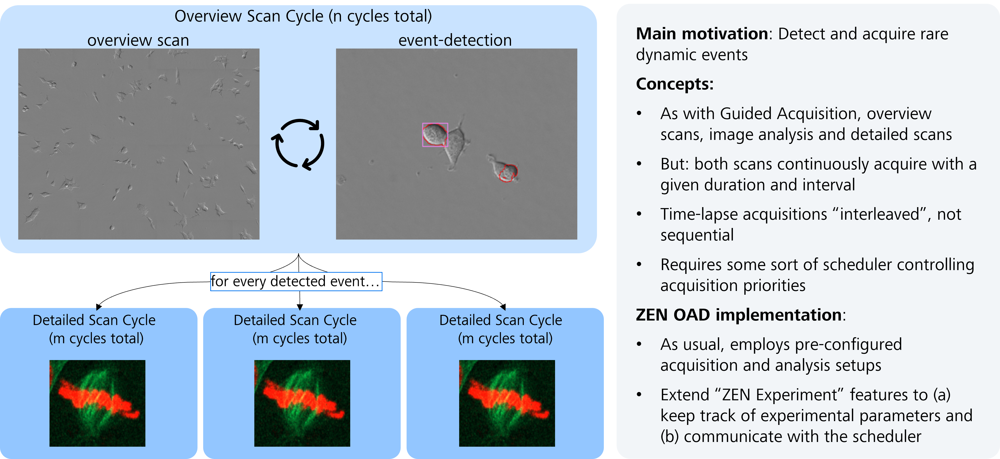

## What it is

This use case describes a simple approach of doing event-driven smart microscopy in OAD. It showcases the detection of mitotic (rounded) cells in a time-lapse phase contrast data set and the concurrent detailed acquisition of said mitotic events. It contains all scripts, images and Deep Learning models to run the use case in simulated mode. 

## How to use it

1) Download the scripts into respective document folders for ZEN. The .czmac file needs to go to the "Macros" folder, the .czexp files need to go to the "Experiment Setups" folder, the .czias file needs to go to the "Image Analysis Settings" folder.e
2) Download the Deep Learning model (version 2) and import them into ZEN using the Intellesis Trainable Segmentation tool. 
3) Download the images into folders of your choice. Create another empty folder. This will be necessary to dynamically load overview images.
4) Validate your ZEN's setup allows simulated experiments (simulated HW config in MTB + Test Camera).
5) Validate the input file paths within the two experimental settings ("SmartImaging_Overview" / "SmartImaging_Detailed") correctly point towards your image folders from step 3. The overview images should come from the newly created folder. Use a mock image in this folder, otherwise it may not be accepted by ZEN.
6) Validate in the "SmartImaging_Main.czmac" script absolute file paths and file names:
   - Line 27: OVERVIEW_BASE = absolute file path to the newly created folder from step 3
   - Line 28: OVERVIEW_RESERVOIR = absolute file path to the folder with all overview images
   - Line 40: absolute file path to an output image folder
7) You should be all set to run the macro. Make sure that the correct experimental setups and image analysis settings are chosen in the initial GUI.
