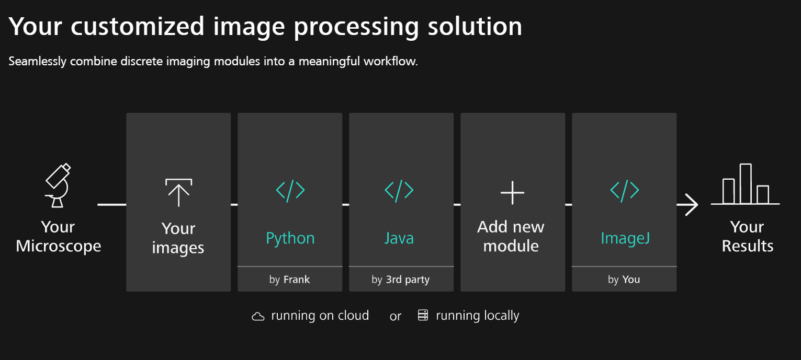

### Welcome & Workshop Introduction

This session will be used for a general welcome. The topic covered by ZEISS will be

* General OAD and Automation topics inside the ZEN ecosystem
* Need for open and scalbale platforms like APEER
* Sneak Preview on ZEN 3.1 topics
* Short overview about the workshop content

***

#### General OAD and Automation topics inside the ZEN ecossystem

For a detailed overview see: **[OAD Overview](https://github.com/zeiss-microscopy/OAD/blob/master/ZEN_Open_Application_Development_OAD_GitHub.pdf)**

***

#### Need for open and scalable platforms like APEER

For more details please see: **[APEER Home](https://www.apeer.com/home/)**

***

#### Sneak Preview ZEN Blue 3.1 - What's new

TBD

***

#### Workshop Content

See agenda: [Workhop Agenda](./2019_MIAP_Zeiss_OAD/2019_miap_zeiss_oad_agenda.md)