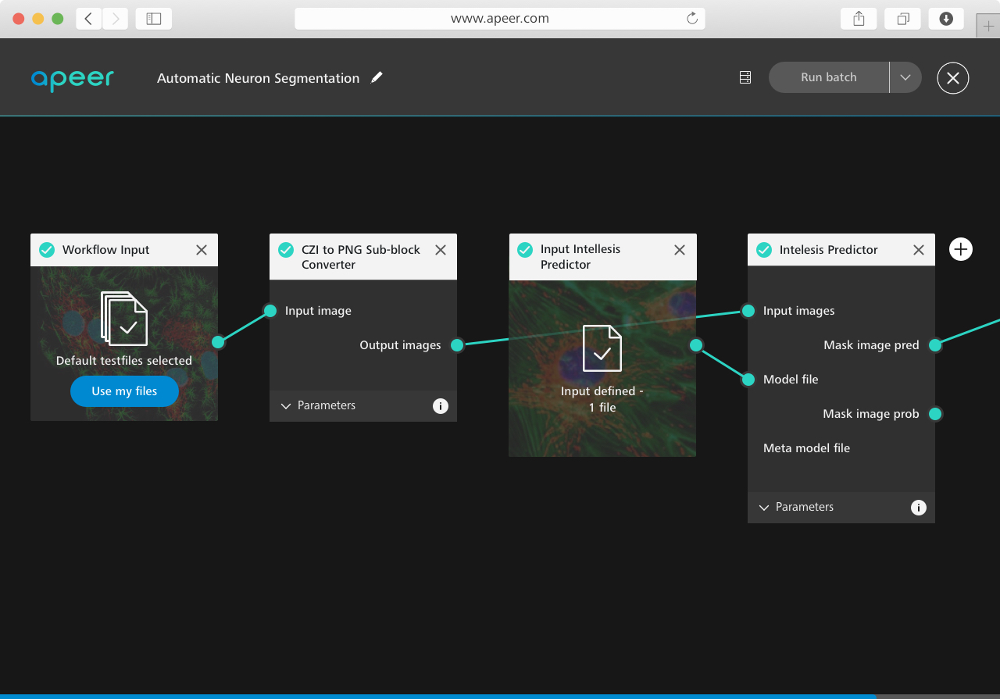

### APEER - Open and Scalable Processing Platform

In this session the basic principles of the APEER platform will be explained.
Most information can be also found on the APEER website, which cab be found here:

**[APEER - Cloud-based Digitial Image Processing Platform](https://www.apeer.com/home/)**

The following topics will be discussed:

* What is APEER and how does it work?
* What problem does it solve?
* Why is ZEISS doing this?
* What about the buisness model behind APEER?

***

### APEER - Usefule Links and Resources

General news and stories about APEER can be found here:

* **[Blog](https://www.apeer.com/blog)**
* **[Twitter apeer_micro](https://twitter.com/apeer_micro?lang=en)**

In case one needs support or has a general question:

* **[Forum](https://forum.apeer.com/)**

For video tutorials on how to use APEER and progra, your own modules please go to:

* **[YouTube Channel](https://www.youtube.com/channel/UCVrG0AsRMb0pPcxzX75SusA)**

***

The APEER team aslo has its own GitHub page where one can find the various APEER SDKs.

* **[GitHub Repository](https://github.com/apeer-micro)**

***

Image Analysis, Python, Docker Containers sound familar to you? Consider becoming part part of our team!

* **[APEER Team - Career Oportunities](https://www.apeer.com/career-page/join-us-on-apeer)**

***

#### APEER Python Packages on PyPi

* **[PyPi - apeer-ometiff-libarry](https://pypi.org/project/apeer-ometiff-library/)**

Library to read and write ometiff images. The project is hostes at [APEER OME-TIFF Library](https://github.com/apeer-micro/apeer-ometiff-library). The documenation can be found at [APEER OME-TIFF Library - Documentation](https://github.com/apeer-micro/apeer-ometiff-library/blob/master/README.md)

* **[PyPi - apeer-dev-kit](https://pypi.org/project/apeer-dev-kit/)**

APEER Python SDK aka (ADK) is a Python library for reading inputs and writing outputs of [APEER](https://www.apeer.com) modules. The ADK will take care of reading inputs from previous modules in APEER and writing your outputs in the correct format for the next mod ule. This project is hosted at [APEER Python SDK](https://github.com/apeer-micro/apeer-python-sdk). The documentation can be found at [APEER Python SDK - Documentation](https://github.com/apeer-micro/apeer-python-sdk/blob/master/README.md).

***

#### Additional genetal resources that might be usefule

* **[Python for Microscopists YouTube Channel](https://www.youtube.com/channel/UC34rW-HtPJulxr5wp2Xa04w)**