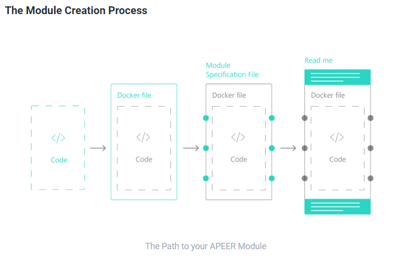

### APEER - Create your won module

The main idea of this session will to go through all the steps required to create your 1s own APEER module.
As an example a simple Fiji based module will be created.

The following things will be dicussed:

* How does the process of module creation works in general?
* What do I need to know about modules?
* What is needed to package my local code into a APEER module?
* How do I test a module?
* How do I integrate my module into a workflow?
* What ways exist to share the module with my peers?

Detailed information about the module creation process can be found here:

* **[APEER - Module Creation](https://docs.apeer.com/create-modules/the-apeer-architecture#the-module-creation-process)**

----

### Source Code for the Tutorial

The source ocde for the Fiji - APEER module can be found here:

* **[Fiji Module Template for APEER](https://github.com/zeiss-microscopy/OAD/tree/master/Apeer/modules/fiji_module_template)**

#### Additional Information and Readings

The following links are very useful when looking for more detalied information and more sophisticated tutorials

* **[APEER Module Creation - Fiji Python Scripting](https://docs.apeer.com/tutorials/fiji-python-scripting)**

* **[Fiji Module - Testing locally inside a Docker Container](https://github.com/zeiss-microscopy/OAD/blob/master/Apeer/modules/fiji_module_template/test_module_locally.md)**

* **[Fiji Module - Testing locally using the APEER Module Debugger](https://docs.apeer.com/create-modules/module-debugging)**