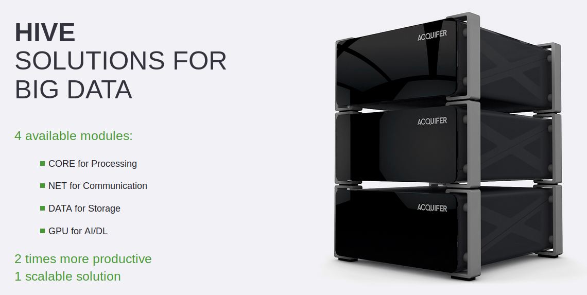
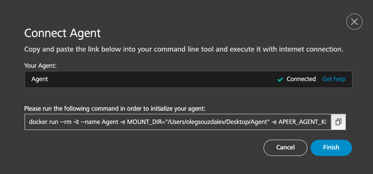

### Acquifer Hive and APEER

This session will show how to use the APEER platform efficiently on the HIVE processing station. Mor information can be found here: [HIVE - Solutions for Big Data](https://www.acquifer.de/data-solutions/)

***

The basic idea is to use the HIVE to run the APEER Hybrid solution locally.
More information about the hybrid solution can be found here: [APEER - Hybrid Solution](https://docs.apeer.com/hybrid/hybrid)