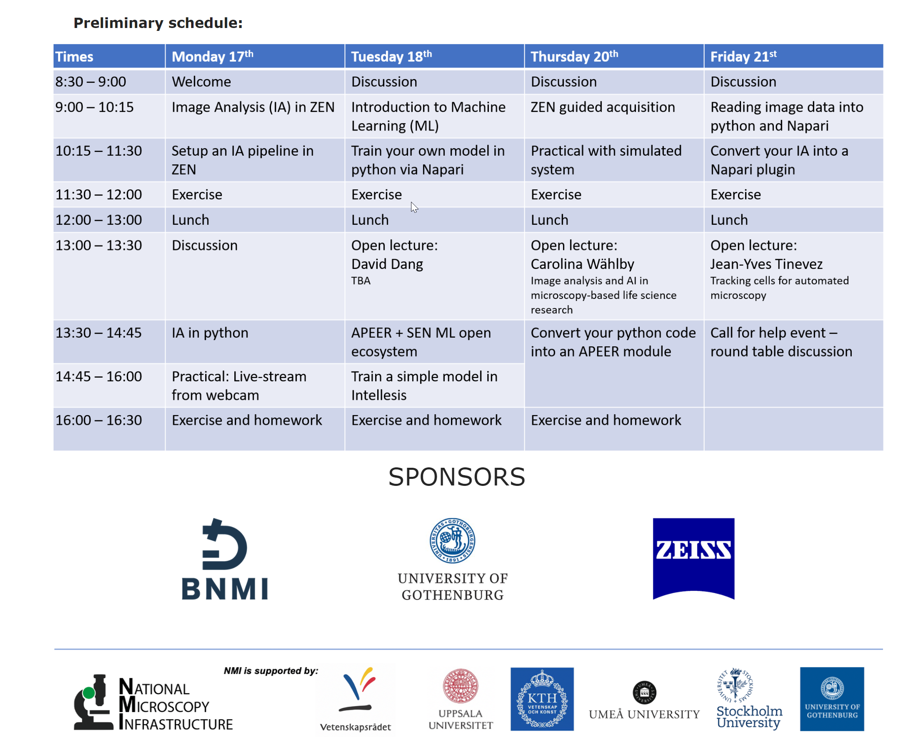

# Smart Microscopy Workshop

## Official Site

The official webpage can be found here: **[Smart Microscopy Webpage](https://nmisweden.se/arkiv/smart-microscopy-image-analysis.html)**

## Schedule

## Sessions

### Prerequisites

- make sure you have ZEN blue 3.4 installed
- during the installation ZEN will install its won python distribution called ZeissPy
  - Do not worry, it will not interfere with any existing python environments
  - Make sure that you enable GPU / disable GPU for python depending on your system
- start the MTB to configure your "virtual" microscope and import the configuration for the CellDiscoverer 7
- make sure you have your own conda python environment ready
- install Docker Desktop. See here **[Docker Desktop](https://docs.apeer.com/zen/windows-and-docker-requirements)**

### APEER and ZEN - Open Ecosystem for integrated Machine Learning

This session will be the introduction to ZEN and APEER machine learning functionalities

### Train a model and use it inside ZEN Intellesis

Use the following notebook **[Train_UNet_Export_as_CZMODEL_final.ipynb](../../Machine_Learning/docs/train_czmodel/Train_UNet_Export_as_CZMODEL_final.ipynb)**

Go to folder: **[train_czmodel](https://github.com/zeiss-microscopy/OAD/tree/master/Machine_Learning/docs/train_czmodel)**

The folder contains also some testdata and related content.

### Convert your python code into an APEER module

This session will be about creating your own APEER module using python (and maybe Fiji jython) code and to use it ZEN later on.

Go to folder: **[APEER modules](https://github.com/zeiss-microscopy/OAD/tree/master/Apeer/modules)**

Ideally we will use the APEER module to create a customized Guided Acquisition workflow in ZEN

Go to folder **[python_script_zen](https://github.com/zeiss-microscopy/OAD/tree/master/Workshops/2021_Smart_Microscopy/python_scripts_zen)**