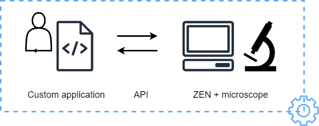
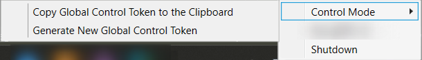
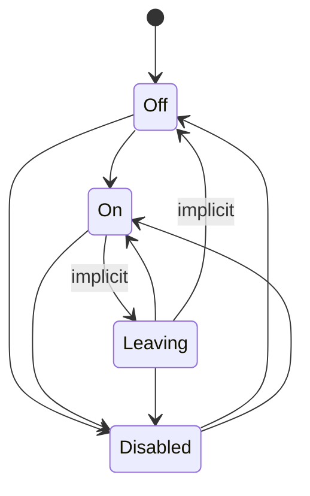
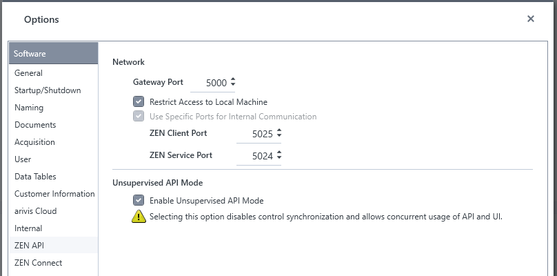
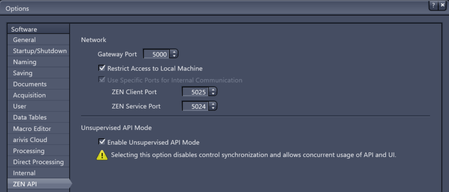

- [ZEN API](#zen-api)
  - [General Overview](#general-overview)
  - [Supported ZEN and ZEN core Versions](#supported-zen-and-zen-core-versions)
  - [Key Features](#key-features)
  - [Installation of ZenApi Gateway](#installation-of-zenapi-gateway)
    - [What is the ZenApi gateway?](#what-is-the-zenapi-gateway)
  - [Configuration](#configuration)
    - [Application configuration](#application-configuration)
    - [Application options](#application-options)
    - [Authentication options](#authentication-options)
    - [Command-line options](#command-line-options)
    - [TLS \& Certificates](#tls--certificates)
  - [Control Management](#control-management)
    - [Controlling and Monitoring APIs](#controlling-and-monitoring-apis)
    - [API Mode](#api-mode)
    - [Unsupervised API Mode](#unsupervised-api-mode)
      - [ZEN Core](#zen-core)
      - [ZEN (blue)](#zen-blue)
    - [API Control Management](#api-control-management)
      - [Global API Control Token](#global-api-control-token)
    - [Combined View](#combined-view)
  - [Troubleshooting](#troubleshooting)
    - [Service Unavailable](#service-unavailable)
    - [Reset Certificates](#reset-certificates)
    - [Common Issues](#common-issues)
      - [Server startup](#server-startup)
        - [Invalid port](#invalid-port)
        - [Used port](#used-port)
        - [Blocked port](#blocked-port)
        - [Invalid host name / IP address](#invalid-host-name--ip-address)
      - [Invoking API methods](#invoking-api-methods)
        - [Missing control token](#missing-control-token)
        - [Cannot run controlling methods](#cannot-run-controlling-methods)
        - [SSL issue on client side](#ssl-issue-on-client-side)
  - [Glossary](#glossary)
  - [Python Examples](#python-examples)
    - [Python Environment](#python-environment)
      - [Prerequisites](#prerequisites)
      - [Python Scripts](#python-scripts)
    - [Configuration File](#configuration-file)
  - [Documentation](#documentation)
  - [DISCLAIMER](#disclaimer)

# ZEN API

## General Overview

ZEN API is an interface to connect a running ZEN application with an external process, possibly running on another machine.
This includes both extracting information (**monitoring APIs**) and actively taking control (**controlling APIs**).
ZEN API may potentially expose any functionality of ZEN products with the exception of controlling the UI.

ZEN API is a foundation for third parties to integrate our products and automate their processes.
It opens a possibility to create applications, UIs or workflows, based on ZEN's SW/HW capabilities and data​.

> **IMPORTANT**: The core idea of ZEN API is to control the Imaging System **from the outside".



> **IMPORTANT**: Note that ZEN API is not replacement for ZEN-internal Scripting based on IronPython (control from the Inside). Both exist and have their purpose and characteristics.

## Supported ZEN and ZEN core Versions

- ZEN API is supported by ZEN (blue) and ZEN core starting with version starting with 3.11 (or better).
- Not all API methods will work for every system or software version
- The [ZEN API Documentation](../ZEN-API/documentation/ZEN_API_Documentation_20250509.md) is always based on the latest ZEN or ZEN core release

## Key Features

In its core ZEN APi is a programming interface that overs various method to control ZEN-base imaging system from the outside.To give a brief overview here some highlights:

- **Managing ZEN Experiments and Acquisition**
  - Check available experiments
  - Loading, Cloning, XML-Export and Saving of an experiment
  - Acquire a SNAP
  - Start and Stop Live Acquisition and Continuous Mode
  - Monitor, Start and Stop Experiments
- **Move XY Stage and Focus**
- **Run Software Autofocus**
- **Modify Experiments**
  - Modify TileRegions and Positions
  - Modify the Z-Stack parameters
  - (De-)Activate and Tracks & Channels
- **Create PixelStream (to be read in Python as array etc.)**
- **Execute ZEN core jobs**

:point_right: Please feel free to use the github issues directly to request new ideas [here](https://github.com/zeiss-microscopy/OAD/issues).

## Installation of ZenApi Gateway

The _ZenApi Gateway_ that is required when using ZEN API. It can be easily installed using the official ZEISS Microscopy Installer Application (ZMI): [Download for ZEISS Microscopy Installer](https://zeiss-microscopy-installer.azureedge.net/public/latest/ZeissMicroscopyInstaller.msi)


- The installation of the protofiles (*.proto) describing the available API methods is optional
  - if selected, the `*.protofiles` will be stored in `C:\Users\Public\Documents\Carl Zeiss\ZEN API Proto Files`
  - the provided Python examples will also work with those *.protofiles
- When _ZenApi Gateway_ is being installed, the installer creates certificates and the control token in case they are missing.
- If certificates or the control token already exist, they are not overwritten (i.e. they are re-used).

**Run _ZenApi Gateway_**

- _ZenApi Gateway_ will be automatically run with start of ZEN (core).
- _ZenApi Gateway_ can be also run as standalone App from start menu.

One can copy the global control token to clipboard or generate a new one from the system tray icon of _ZenApi Gateway_ (see the screenshot below). Additionally, the control token can be read from file located at _C:\ProgramData\Carl Zeiss\ZenApiGateway\GlobalControlToken.txt_.

More info about global control token can be found [here](#global-api-control-token).



### What is the ZenApi gateway?

The ZenApi Gateway is a separate application that is required when using ZenApi. It fulfills multiple purposes.

- serve as single point of contact for ZenApi clients. Otherwise they would need to connect to every Api provider separately, which would require to know the internal architecture of different processes in a Zeiss Microscope software setup and also know exactly which of those applications is implementing which API.

To avoid this, the gateway

- aggregates the api description (gRPC reflection)
- aggregates the api documentation (might render it as web pages)
- care about cross cutting concerns (so that Api providing applications don't have to do it)
  - access management (authentication + authorization)
  - control management (if/when a client may control the system, esp. also with multiple connected clients)

Technically, it

- comes with a small, optional UI component when running on Windows (system tray icon with context menu and configurable notifications, primarily helpful while debugging and testing)
- shows a tool tip with program version, configured host and port as well as a list of connected API providers
- makes some basic commands available via a context menu.
  - generate token (prototype for simple authentication)
  - shutdown
- can show notifications, e.g. when a new API providing application is registered
- will define a small set of apis on its own to manage and configure itself
- is independent from any other application
- does not have to run on the same machine as Zen, but can run anywhere on the local network
- will run with TLS by default
  - to allow https by default, the gateway will generate self-signed certificates automatically if no certificates are configured
  - a custom root certificate can either be installed on the machine or instead be configured explicitly
- can only be started once :arrow_right: allows ZEN applications to start it to ensure it is running without checking if it is already running or not (as it will do that on its own).

## Configuration

The ZenApiGateway can be configured/controlled by the configuration and command-line options.

### Application configuration

Application configuration is stored in **appsettings.json** file with some command-line options having the possibility to override the configuration values they are mapped to.

The user is expected to modify only the following sections in the configuration file:

- **Logging:LogLevel**
- **Application**
- **Authentication**

### Application options

| Configuration section | Description                                                     |
| --------------------- | --------------------------------------------------------------- |
| Application:Port      | The port to run on                                              |
| Application:Address   | The IP address to run on. Special addresses: 'any', 'localhost' |
| Application:DebugMode | Enable or disable debug mode                                    |

The special addresses have the following meaning/effect:

- **any**: the gateway will listen on the specified port on all network interfaces/IP addresses and both IPv4 and IPv6 protocols
- **localhost**: the gateway will listen on the specified port on localhost and both IPv4 (127.0.0.1) and IPv6 (::1) protocols
- **Specific IPv4 or IPv6 address**: the gateway will listen on the specified port and IP address and protocol

### Authentication options

| Configuration section             | Description                                                                                  |
| --------------------------------- | -------------------------------------------------------------------------------------------- |
| Authentication:Enable             | Enable or disable authentication at all or use insecure connections                          |
| Authentication:CertificatePemPath | Path to the pem certificate to use (with corresponding *.key file next to it)                |
| Authentication:RootCA             | Path to the pem certificate of the root CA to use (with corresponding *.key file next to it) |
| Authentication:ApiKey             | API key used as secret to generate tokens                                                    |

### Command-line options

The ZenApiGateway can be started with the following command-line options:

| Short name | Long name                       | Description                                                                                  | Overrides configuration parameter |
| ---------- | ------------------------------- | -------------------------------------------------------------------------------------------- | --------------------------------- |
| -p         | --port                          | The port to run on                                                                           | Application:Port                  |
| -a         | --address                       | The IP address to run on. Special addresses: 'any', 'localhost'                              | Application:Address               |
| -c         | --certificate                   | Path to the pem certificate to use (with corresponding *.key file next to it)                | Authentication:CertificatePemPath |
| -r         | --root-ca                       | Path to the pem certificate of the root CA to use (with corresponding *.key file next to it) | Authentication:RootCA             |
|            | --show-console                  | Show console window on start (only available on Windows)                                     |                                   |
| -l         | --log-level                     | Set the default log level                                                                    | Logging:LogLevel:Default          |
| -g         | --generate-global-control-token | Generates a new global control token which replaces the old one                              |                                   |
|            | --help                          | Displays help text                                                                           |                                   |

```powershell
start /wait ZenApiGateway.exe --show-console
```

**Note:** Currently the "--debug-mode" option doesn't actually change the behavior of the gateway. The only difference is that it show windows notifications (e.g., when an app registers on the gateway) and we have an additional HTTP webpage on URL "/hello" which returns "Hello World!".

### TLS & Certificates

The gateway will use TLS if possible.

- If a certificate is configured, it is used
- Otherwise if a certificate at the default location (C:\ProgramData\Carl Zeiss\ZenApiGateway\Certificates) is found, it is used
- Otherwise a certificate at the default location is generated and used (using a self-signed root certificate that is also generated)

The gateway uses mTLS to communicate with Zen applications ("api providers"). For that, the same certificate is used as a client certificate (when the gateway connects to Zen the gateway acts as a client). Both applications validate the certificate of the other site. For that, the normal root certificates installed on the machine (either for the user or machine) are used.

If configured, an additional root certificate will be considered that does not need to be installed on the machine. This allows to validate self-signed certificates with the generated root-CA without installing that on the machine.

## Control Management

To prevent unintended or unauthorized use of the system from the outside (i.e. via ZEN API), management of access control is needed.

### Controlling and Monitoring APIs

In order to not limit ZEN API access excessively where not needed, ZEN API methods are put into two categories:

- _monitoring APIs_ are methods that do not have side effects, i.e. do not change the state of the system and thus must not create conflicts when executed at any time. For example, reading a hardware parameter or some other state would be a monitoring method. Access to those is considered uncritical and will not be limited (in addition to authentication).

When defining APIs, monitoring API methods need to be marked as such with the `[MonitoringApiMethod]` attribute.

- _controlling APIs_ are all other methods that may cause conflicts or errors when executed randomly or in an unexpected sequence, for example moving hardware.
When defining APIs, controlling API methods do not need to be marked as such as this is the default (since _monitoring_ should be well considered).

:point_right: There will be cases that may not clearly map to one of those categories.

### API Mode

_API Mode_ is a way to prevent actions to be started via UI and API at the same time. When _API Mode_ is enabled, the UI is mostly locked and any API calls are allowed. When _API Mode_ is disabled, UI is free but only uncritical _monitoring APIs_ are allowed to be called, i.e. APIs that do not change the system state but only read or monitor it.

It is possible to disable control synchronization and allow (potentially unsafe) usage of ZEN API and UI at the same time for expert users. Such mode is called _Unsupervised API Mode_ and, when enabled, the user is responsible for the alignment of system interactions. Please refer to [Unsupervised API Mode section](#unsupervised-api-mode) for more details.  

Some functions cannot be represented in both modes and need a clear owner. E.g. when exiting _API Mode_ and a controlling ZEN API call (e.g. workflow, experiment or stage movement) is still running, the user will be informed about it and asked to stop it or to stay in _API Mode_.

_API Mode_ can have one of the following values:

- **On**: controlling and monitoring API methods can be called
- **Off**: only monitoring API methods can be called
- **Leaving**: implicit API mode representing the transition from _On_ to _Off_
- **Disabled**: Unsupervised API Mode

ZEN client requests change of API mode (to On, Off or Disabled) to the gateway.

The following diagram shows the possible transitions between API Modes:



Note: The transition from _On_ to _Off_ is done through _Leaving_ API mode. The gateway will first change the _API Mode_ to _Leaving_ which will prevent the users from calling the controlling API methods but still make it possible for the currently active controlling API method calls to finish. The gateway will change the _API Mode_ from _Leaving_ to _Off_ only once all active controlling API method calls are finished. It is possible to return back to _API Mode_ _On_ while _API Mode_ is set to _Leaving_.

Note:

- The active controlling API calls can be cancelled by an API provider.
- The controlling API calls can be of two types: direct and detached.
- The direct API calls are directly cancelled by the gateway, but for detached calls a cancellation request is sent to the API provider to which the detached call belongs to.

### Unsupervised API Mode

> **IMPORTANT**: _Unsupervised API Mode_ allows concurrent usage of UI and ZEN API (both _monitoring_ and _controlling_ APIs). This mode is meant for expert users as it is potentially unsafe and the user takes responsibility for the alignment of system interactions.

> :warning: **Use the unsupervised ZEN API mode at your own risk!**

If _Unsupervised API Mode_ is not enabled, only _monitoring API_ calls can be used when in UI.

#### ZEN Core

Enabling and disabling of _Unsupervised API Mode_ can be done in _Maintenance_ -> _General Options_ -> _ZEN API_ using the checkbox "Enable Unsupervised API Mode".



If _Unsupervised API Mode_ is enabled, "_API Mode_" button in UI home screen is hidden.


Information that _Unsupervised API Mode_ is running in shown in the main tool bar of ZEN Core (top right part of the application) if:

- _Unsupervised API Mode_ is enabled, and
- API server is running.


#### ZEN (blue)

Enabling and disabling of _Unsupervised API Mode_ can be done in _Tools_ -> _Options_ -> _ZEN API_ using the checkbox "Enable Unsupervised API Mode".



Information that _Unsupervised API Mode_ is running in shown in the status bar of ZEN (bottom right part of the application) if:

- _Unsupervised API Mode_ is enabled, and
- API server is running.


:warning: _Note: Supervised API Mode is currently not fully supported in ZEN. One can enable Supervised API Mode (i.e., when Unsupervised API Mode is disabled), but there is currently no UI to enable the use of controlling API calls (like API Mode in ZEN Core)._

### API Control Management

In order to align calls to controlling APIs, i.e. those that change the state of the system, the right to do this should be limited to one entity. This entity may consist of multiple processes or applications, but those are responsible then to sync their actions.

To support complex multi-client cases but keep it easier for simple cases, there is currently only one version of API control management:

- **Global API control token**

#### Global API Control Token

The global access control is appropriate for setups with only one client or where multiple clients are orchestrated by other means, e.g. expert knowledge on the processes and their dependencies.

Since the global access control is currently the only enabled version of API control management, it is enabled by default. The token can be changed at any time by either:

- changing the token in the system tray app (Windows only)
- changing the token with a command-line option
- changing the file where it is persisted (`%PROGRAMDATA%\Carl Zeiss\ZenApiGateway\GlobalControlToken.txt`) and by restarting the gateway so that it loads the new value

A "global control token" is required for calling API methods. The token must be sent in the `control-token` header of the API call and it must match the token in the gateway. If the token is missing, the API call will be aborted with an access control error.

### Combined View

The following flow chart shows the steps and checks performed in the API gateway for incoming requests.


How decisions are made:

**Kind of API?**

- C# API definition marks monitoring API methods with the `[MonitoringApiMethod]` attribute (see above)
- Based on that, the customized proto builder used in the ZEN API Server adds custom proto options to proto files that mark monitoring methods
- The gateway uses gRPC reflection to extract the list of available APIs from the API providers. This is based on the proto files and thus contains the custom option on monitoring APIs
- This is used to configure required authorization policies to access each API method

**In API mode?**

- The gateway provides a special, internal API to be used by API providers to control API mode, e.g. enter and leave it.

Depending on the configured mode, the implementation of some steps are slightly different:

| Decision          | Global Control Token                                                     |
| ----------------- | ------------------------------------------------------------------------ |
| Is authenticated? | Request header contains global API control token                         |
| Has control?      | Yes (obsolete in this case, as control token was already checked before) |

## Troubleshooting

This page should give an overview of some common things to try when working with a development version. If this does not help, please contact your local ZEISS microscopy representative.

### Service Unavailable

Ensure that the application providing the called API is:

- running (e.g. ZEN Core/blue)
- connected to the gateway
- providing that exact service and method (e.g. that it is actually implemented and included in the currently running profile)

To check basic connection, have a look in the tool-tip of the tray icon of the gateway. It shows which applications are connected and how many services they have registered:


### Reset Certificates

Certificates are used to securely communicate between ZEN applications, the gateway, and clients. By default, we use self-signed certificates that are automatically generated by the gateway if not available.

Therefore, if you suspect some issue with them, you can try to delete them and and let the Gateway generate new ones the next time it is started.

Certificates are located in `C:\ProgramData\Carl Zeiss\ZenApiGateway\Certificates`

### Common Issues

The following issues can happen due to invalid configuration or usage, but should all be identified by the system and reported with explanatory error messages.

#### Server startup

##### Invalid port

Ports need to be in valid range of 1024 - 65.535. When using ZEN settings dialog, this is ensured automatically.

##### Used port

Ports can only be used by one application, so if another application is already listening of a port that is also configured for either the ZEN API gateway or one of the API providing applications, startup of ZEN API will fail.

##### Blocked port

Some ports may be blocked or reserved by the system and cannot be used by arbitrary applications, even if currently not used actively.

##### Invalid host name / IP address

The host for the gateway may only be:

- "localhost" or "any"
- the corresponding IP representations of "127.0.0.1" or "0.0.0.0"
- another valid IP address of the machine (or rather one of its network adapters)

#### Invoking API methods

##### Missing control token

Clients need to authenticate at the gateway. This can currently only be done with the global control token that can be generated and copied from the context menu of the gateway.

##### Cannot run controlling methods

The error message can look like this: "_Permission denied - Execution of API methods that can change the system state is currently not allowed_".

Methods marked as controlling require that ZEN is in _API Mode_ (currently ZEN Core only) or configured to run _unsupervised API Mode_ (ZEN Core and blue edition). If this is not the case, API clients should get a proper error message explaining the issue.

In such cases, please also check if the proper control token is sent to the gateway with gRPC request.

##### SSL issue on client side

API clients need to use TLS encryption when connecting to the gateway. They may, however, choose to validate the server certificate or not (although it is highly recommended when the client is not on the same machine as the gateway).

## Glossary

| Term                       | Definition                                                                                                                                                                                                                                                                                                                                                                                                          |
| -------------------------- | ------------------------------------------------------------------------------------------------------------------------------------------------------------------------------------------------------------------------------------------------------------------------------------------------------------------------------------------------------------------------------------------------------------------- |
| **ZEN API**                | The whole product – or some part of it – depending on the context.                                                                                                                                                                                                                                                                                                                                                  |
| **ZEN API Infrastructure** | The **internal** framework that allows to add and implement new APIs.                                                                                                                                                                                                                                                                                                                                               |
| **API Provider**           | An application in the ZEN ecosystem that offers APIs (e.g., ZEN Blue Client, ZEN Core Client, ZEN Service, MTB, etc.).                                                                                                                                                                                                                                                                                              |
| **ZEN API Gateway**        | A small application that:<br><br>- needs to be installed with each system that should run ZEN API<br>- serves as single point of contact for API clients (i.e. one address to connect to)<br>- handles authentication and some other common concerns<br>- forwards API calls to the proper API provider (of potentially multiple ones that can be registered)<br>- can be considered part of ZEN API infrastructure |
| **API Server**             | Server supplied by the API infrastructure that must be started inside each API Provider.                                                                                                                                                                                                                                                                                                                            |
| **API Client**             | Any application (written in any language) that interacts with an API Provider via ZEN API.                                                                                                                                                                                                                                                                                                                          |
| **gRPC**                   | The transport technology/protocol used by ZEN API.<br><br>Google-developed, high-performance RPC framework that uses HTTP/2 and Protocol Buffers for fast, strongly-typed, cross-language communication.                                                                                                                                                                                                            |
| **Proto File**             | Protobuf-language description of a portion of the API (as used by gRPC).                                                                                                                                                                                                                                                                                                                                            |

## Python Examples

Those examples are meant tp "play around" and test ZEN API functionality. They come without any warranty and can be used at your own risk. See also [DISCLAIMER](#disclaimer)

### Python Environment

In order to use ZEN API from Python one needs to create a suitable python environment.
In case one needs a new environment here please create on freshly using the [env_zenapi.yml](../ZEN-API/python_examples/python_env/env_zenapi.yml)

#### Prerequisites

- Make sure the ZEN API gateway is installed
- Generate the control token
- Install conda or [miniconda](https://docs.anaconda.com/free/miniconda/) or [miniforge](https://conda-forge.org/miniforge/) base environment

Open CMD or PowerShell etc. and create a new python environment:

```powershell
conda env create --file env_zenapi.yml
conda activate zenapi
```

> **IMPORTANT**: Please feel free to use your own environment and install only the packages you really need!

#### Python Scripts

Inside this repository one can find several example and the python classes, that were translated from protofiles automatically inside the [python_examples\public](../ZEN-API/python_examples/public/) folder.

```txt
.
└── target_folder/
    ├── public/
        ├── zen_api/
        │   ├── acquisition/
        │   ├── application/
        │   ├── common/
        │   ├── hardware/
        │   ├── lm/
        │   ├── workflows/
        │   └── __init__.py
        ├── __init__.py
    ├── your_zenapi_scripts.py
        └── ...
```

Feel free to arrange this to your needs but make sure the import inside your python scripts still work.

### Configuration File

Make sure the `config.ini` is adapted to reflect your local values. An example is shown here:

```ini
[api]
host = 127.0.0.1
port = 5000
cert_file = C:\ProgramData\Carl Zeiss\ZenApiGateway\Certificates\ZenApiPersonalSigningRootCA.pem
control-token = ...
```

## Documentation

Currently the documentation for the latest ZEN release with respect to ZEN API can be found here: **[ZEN API - Documentation](../ZEN-API/documentation/ZEN_API_Documentation_20250509.md)**

## DISCLAIMER

The provided examples are free to use for everybody. Carl Zeiss Microscopy GmbH's ZEN software undertakes no warranty concerning the use of those scripts, image analysis settings and ZEN experiments.

> :warning: **Use ZEN API and the examples at your own risk!**

Additionally Carl Zeiss Microscopy GmbH's ZEN software allows connection and usage to the third party software packages.
Therefore Carl Zeiss Microscopy GmbH undertakes no warranty concerning those software packages, makes no representation that they will work on your system and/or hardware and will not be liable for any damages caused by the use of any scripts or examples inside this repository.

By using any of those examples you agree to this disclaimer.

Version: 2025.05.16

Copyright (c) 2025 Carl Zeiss AG, Germany. All Rights Reserved.
