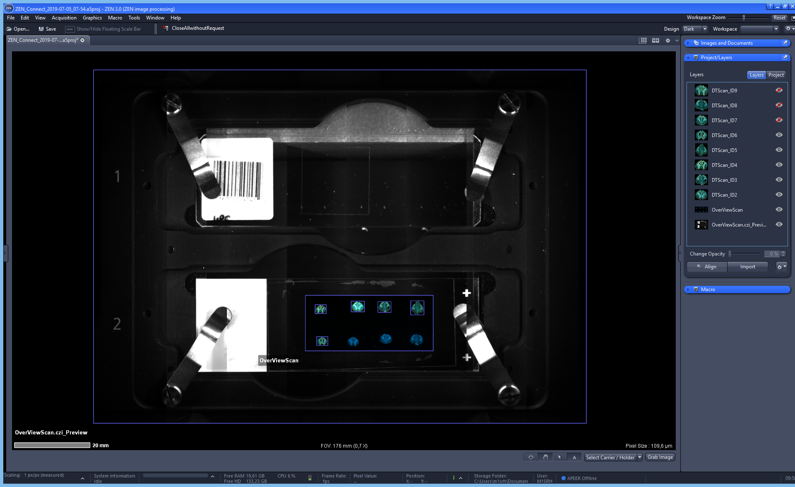
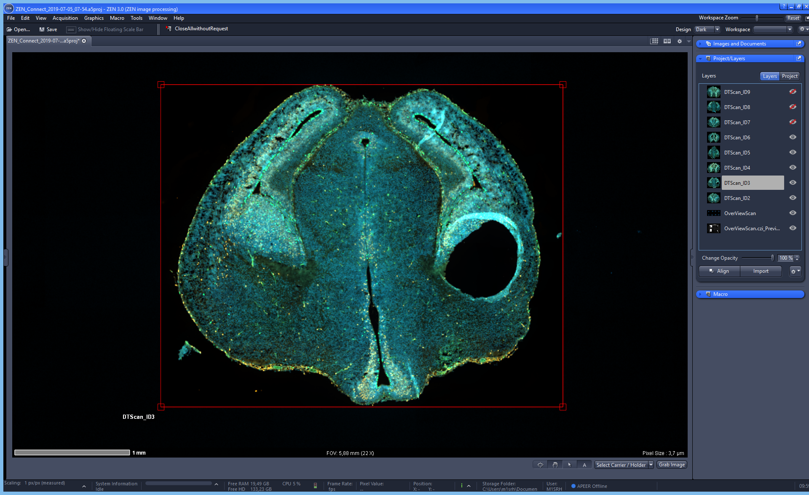
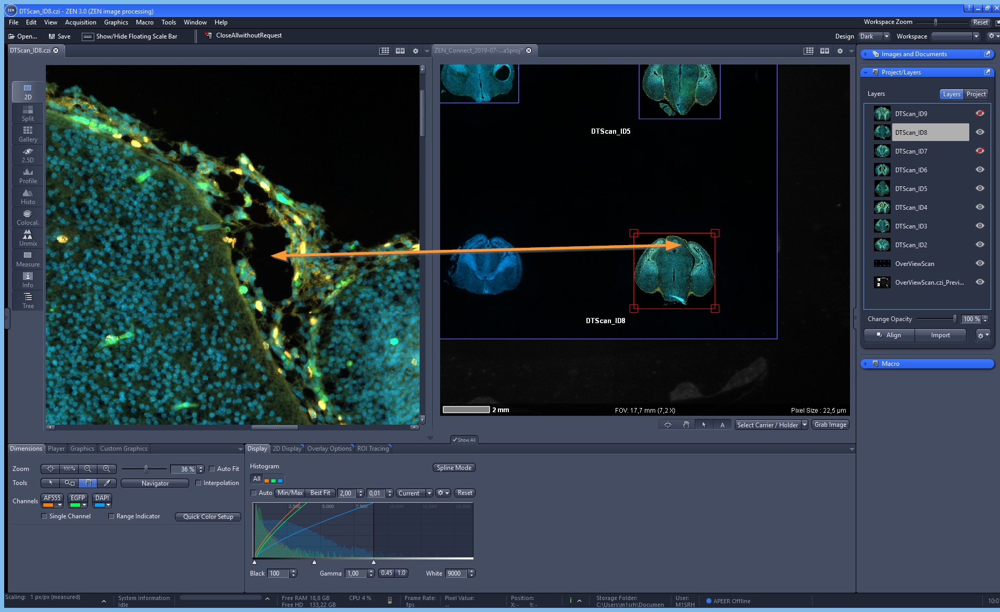
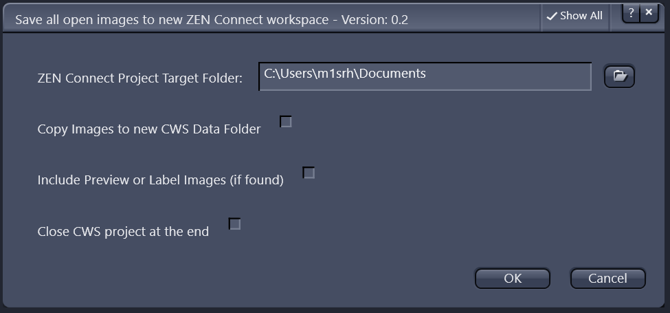
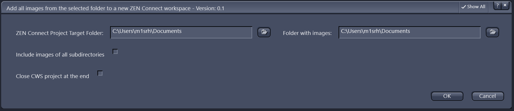

## ZEN Connect

### Overlay and Organize Images From Any Source to Connect Your Multimodal Data

* combine multiple perspectives of your sample across scales and imaging modalities
* organize and navigate inside any image – ZEISS or not due to 3rd party import
* acquire an overview image of your large sample on a low magnification system, then switch or move to your confocal or electron microscope and align.
* Use the aligned overview image for navigation and all subsequent images will automatically be shown in context.
* Simply use ZEN Connect to align and overlay images from any source.

More information can be found here: [ZEN Connect](https://www.zeiss.com/microscopy/int/products/microscope-software/zen-connect-image-overlay-and-correlative-microscopy.html)

***

### Applications

*ZEN Connect project workspace with all the imported images incl. sample carrier image*

***

*Zoomed-in image of one of the objects acquired with high resolution*

***

*Side-by-Side view of the project workspace and one of the detailed images in ZEN blue*

## ZEN Connect - Automation

The import of images into a ZEN Connect project can be easily automated via python scripting.

### [ZENConnect_SaveAllImagesAsCWS.py](../ZEN_Connect/scripts/ZENConnect_SaveAllImagesAsCWS.py)

* Save all open image documents to a new CWS project
* Check if image contains preview or label images and add them as well
* Use with ZEN Blue 3.4 or newer

### [Add_Images_from_folder_to_ZEN_Connect.py](../ZEN_Connect/scripts/Add_Images_from_folder_to_ZEN_Connect.py)

* Add all images found in a folder to a ZEN Connect project
* Do this recursively as option
* Use with ZEN Blue 3.4 or newer

