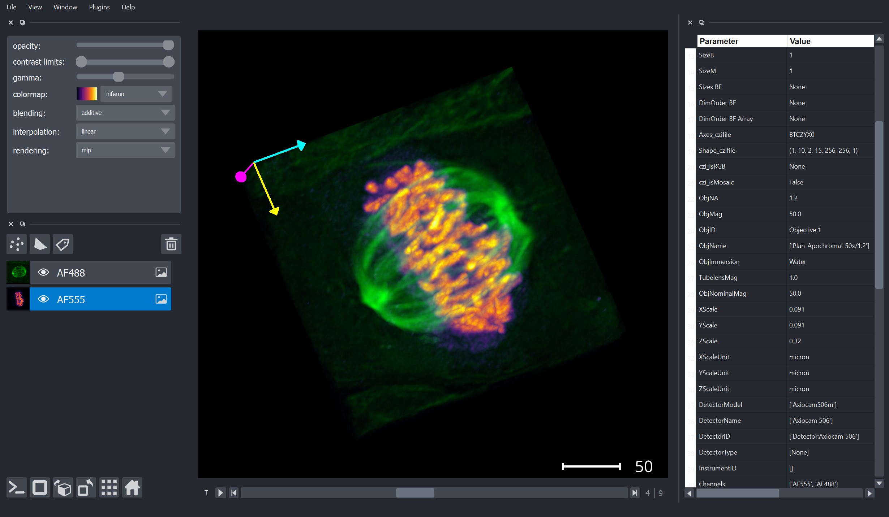

### Read CZI or OME-TIFF and Display Images Napari

This juypter notebook demonstrates different options to read a CZI or OME-TIFF using different python libraries

***Important Libraries to run this notebook***

* [PyPi - czifile](https://pypi.org/project/czifile/)

Thanks to Christoph Gohlke. For details and the source code please see [czifile.py](https://www.lfd.uci.edu/~gohlke/code/czifile.py.html)

* [PyPi - apeer-ometiff-library](https://pypi.org/project/apeer-ometiff-library/)

More information on the source code can be found on the APEER GitHub project page.

* [PyPi - napari](https://pypi.org/project/napari/)

Very new, fast and cool multi-dimensional array viewer.

* imagefileutils.py

This is collection of of useful function to read CZI and OME-TFF image files. This tool uses many of the modules mentioned above.

***

