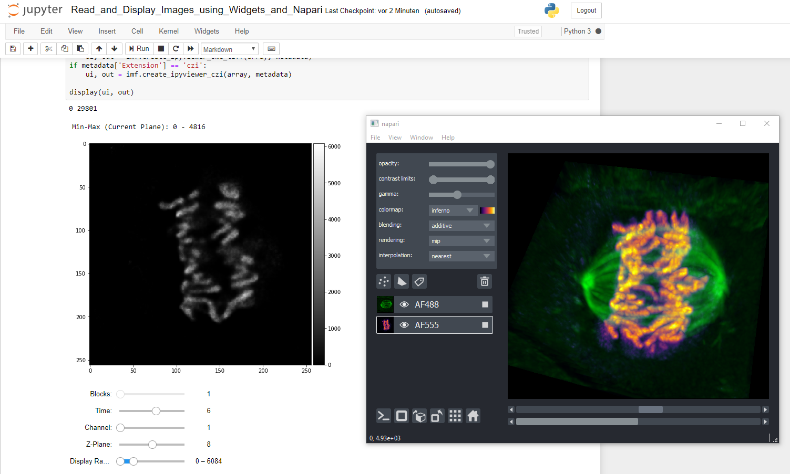

### Read CZI or OME-TIFF and Display Images using widgets and Napari Viewer

This juypter notebook demonstrates different options to read a CZI or OME-TIFF using different python libraries

***Import Libaries to run this notebook***

* [PyPi - czifile](https://pypi.org/project/czifile/)

Thanks to Christoph Gohlke. For details and the source code please see [czifile.py](https://www.lfd.uci.edu/~gohlke/code/czifile.py.html)

* [PyPi - apeer-ometiff-library](https://pypi.org/project/apeer-ometiff-library/)

It uses parts of python-bioformats library: [PyPi - python-bioformats](https://pypi.org/project/python-bioformats/).

More information on the source code can be found on the APEER GitHub project page: [GitHub - apeer-ometiff-library](https://github.com/apeer-micro/apeer-ometiff-library)

* [PyPi - napari](https://pypi.org/project/napari/)

Very new, fast and cool multi-dimensional array viewer. For more details see the project page [GitHub - napari](https://github.com/napari/napari)

* imagefileutils

This is collection of of usefule function to read CZI and OME-TFF image files. This tool uses many of the modules mentioned above.

***

Other important modules

* [PyPi - xmltodict](https://pypi.org/project/xmltodict/)

This is turns an XML, e.g. the OME-XML or CZI metadata into an "easy-to-use" python dictionary.

***

