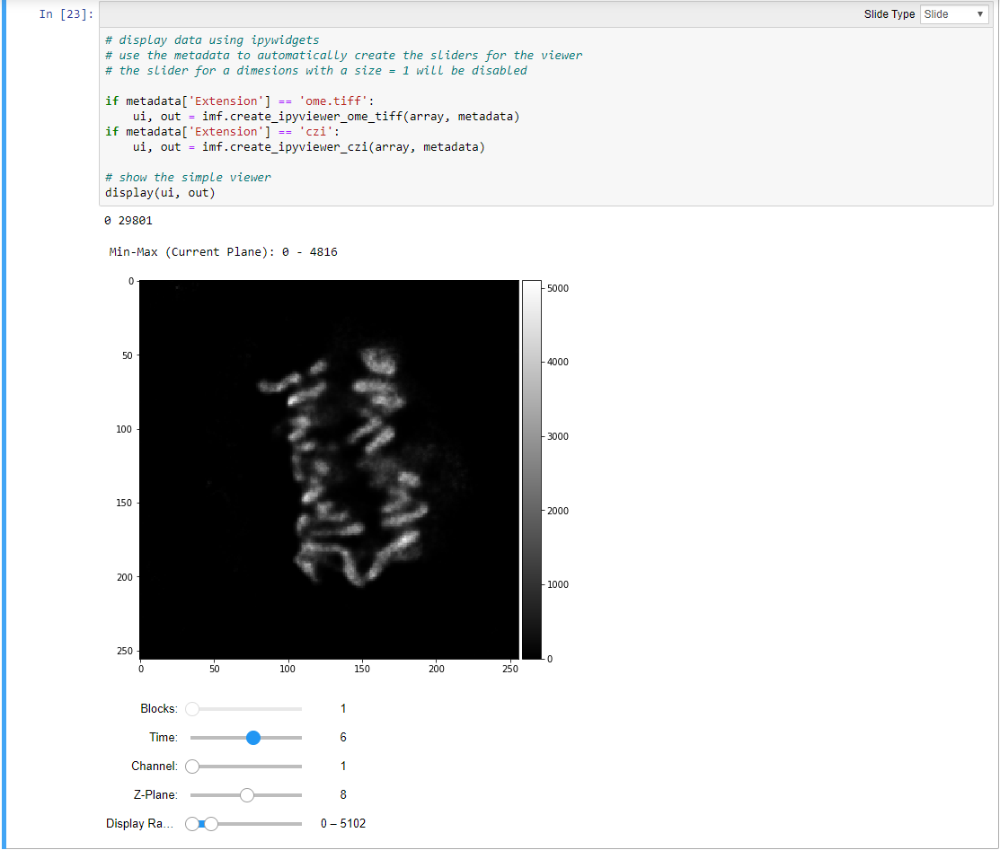

```python
########################################################################
# File       : Read_and_Display_Images_using_Widgets_and_Napari.ipynb
# Version    : 0.1
# Author     : czsrh
# Date       : 12.11.2019
# Insitution : Carl Zeiss Microscopy GmbH
#
# Disclaimer: Just for testing - Use at your own risk.
# Feedback or Improvements are welcome.
########################################################################
```

***Import Libaries to run this notebook***

* [PyPi - czifile](https://pypi.org/project/czifile/)

Thanks to Christoph Gohlke. For details and the source code please see [czifile.py](https://www.lfd.uci.edu/~gohlke/code/czifile.py.html)

* [PyPi - apeer-ometiff-library](https://pypi.org/project/apeer-ometiff-library/)

It uses parts of python-bioformats library: [PyPi - python-bioformats](https://pypi.org/project/python-bioformats/).

More information on the source code can be found on the APEER GitHub project page: [GitHub - apeer-ometiff-library](https://github.com/apeer-micro/apeer-ometiff-library)

* [PyPi - napari](https://pypi.org/project/napari/)

Very new, fast and cool multi-dimensional array viewer. For more details see the prject page [GitHub - napari](https://github.com/napari/napari)

* imagefileutils

This is collection of of usefule function to read CZI and OME-TFF image files. This tool uses many of the modules mentioned above

***

Another important modules

* [PyPi - xmltodict](https://pypi.org/project/xmltodict/)

This is turns an XML, e.g. the OME-XML or CZI metadata into an "easy-to-use" python dictionary.


```python
# this can be used to switch on/off warnings
import warnings
warnings.filterwarnings('ignore')
warnings.simplefilter('ignore')

# import the libraries mentioned above
from apeer_ometiff_library import io, processing, omexmlClass
import czifile as zis
import xmltodict
import os
import numpy as np
import ipywidgets as widgets
import napari
import imgfileutils as imf
import xml.etree.ElementTree as ET
import time
```


```python
# define your testfiles here

#filename = r'testdata\CellDivision_T=10_Z=15_CH=2_DCV_small.ome.tiff'
filename = r'testdata\CellDivision_T=10_Z=15_CH=2_DCV_small.czi'
```


```python
# To read the CZI metadata one can use the czifile functionality.
# In this step we only read the metadata as a string, which contains the XML
# That string is afterwards parsed into an python dictionary

# get czi object using the filename
czi = zis.CziFile(filename)

# get the metadata and close the czi file object
mdczi = czi.metadata()
czi.close()

# parse the XML into a dictionary
metadatadict_czi = xmltodict.parse(mdczi)
```


```python
# Sometimes it can be very useful to save the CZI metadate as an actual XML file.
# This can be done quite easily by converting the metadata string into an XML tree.
# This tree object can be directly as an XML file

# define the new filename for the XML to be created later
xmlfile = filename.replace('.czi', '_CZI_MetaData.xml')

# get the element tree
tree = ET.ElementTree(ET.fromstring(mdczi))

# write xml to disk
tree.write(xmlfile, encoding='utf-8', method='xml')

print('Write special CZI XML metainformation for: ', xmlfile)
```

    Write special CZI XML metainformation for:  testdata\CellDivision_T=10_Z=15_CH=2_DCV_small_CZI_MetaData.xml
    


```python
# the functionaliyt from above is also part of the imgfileutils.py
# and be be easily used with just one line of code
xmlczi = imf.writexml_czi(filename)
print(xmlczi)
```

    testdata\CellDivision_T=10_Z=15_CH=2_DCV_small_CZI_MetaData.xml
    


```python
# The metadata of an CZI contain vaious main sections as illustrated below
# Here a dictionary is created that contains some important key like information

czimd = {}

czimd['Experiment'] = metadatadict_czi['ImageDocument']['Metadata']['Experiment']
czimd['HardwareSetting'] = metadatadict_czi['ImageDocument']['Metadata']['HardwareSetting']
czimd['CustomAttributes'] = metadatadict_czi['ImageDocument']['Metadata']['CustomAttributes']
czimd['Information'] = metadatadict_czi['ImageDocument']['Metadata']['Information']
czimd['PixelType'] = czimd['Information']['Image']['PixelType']
```

***Reading the actual pixel data into an n-dimensional array***

Beside reading the metadata of an CZI or OME-TIFF file the pixel data itself
are probably the most interesting topic.
In order to actually read the pixel data correctly one will also need the correct metadata.

* for reading an OME-TIFF file the apeer-ometiff-library will be used
* for reading an CZI file the czifile.py will be used

***Important Remark***

The czifile module cannot ready "any" CZI image yet. Especially when a CZI has many scences,
which are physically separated one might run into memory issues (depending on your machine).


```python
# read metadata and array differently for OME-TIFF or CZI data
if filename.lower().endswith('.ome.tiff') or filename.lower().endswith('.ome.tif'):
    
    # return value is an array of order (T, Z, C, X, Y)
    (array, omexml) = io.read_ometiff(filename)
    # convert omexml metadata into the dictionary
    metadata = imf.get_metadata(filename, series=0)
    
if filename.lower().endswith('.czi'):

    # get the array and the metadata dictionary
    array, metadata = imf.get_array_czi(filename)
```


```python
# show some selected properties of the array and the metadata

# shape of numpy array containg the pixel data
print('Array Shape: ', array.shape)

# dimension order from metadata as returned by BioFormats for OME-TIFF
print('Dimension Order (BioFormats) : ', metadata['DimOrder BF Array'])

# shape and dimension entry from CZI file as returned by czifile.py
print('CZI Array Shape : ', metadata['Shape'])
print('CZI Dimension Entry : ', metadata['Axes'])
```

    Array Shape:  (1, 10, 2, 15, 256, 256)
    Dimension Order (BioFormats) :  None
    CZI Array Shape :  (1, 10, 2, 15, 256, 256, 1)
    CZI Dimension Entry :  BTCZYX0
    


```python
# show some important dimensions and the scaling

print('SizeT : ', metadata['SizeT'])
print('SizeZ : ', metadata['SizeZ'])
print('SizeC : ', metadata['SizeC'])
print('SizeX : ', metadata['SizeX'])
print('SizeY : ', metadata['SizeY'])
print('XScale: ', metadata['XScale'])
print('YScale: ', metadata['YScale'])
print('ZScale: ', metadata['ZScale'])
```

    SizeT :  10
    SizeZ :  15
    SizeC :  2
    SizeX :  256
    SizeY :  256
    XScale:  0.091
    YScale:  0.091
    ZScale:  0.32
    


```python
# in order to show the complete metadata dictionary set True
show_all_metadata = True

if show_all_metadata:
    # show all the metadata
    for key, value in metadata.items():
        # print all key-value pairs for the dictionary
        print(key, ' : ', value)
```

    Directory  :  testdata
    Filename  :  CellDivision_T=10_Z=15_CH=2_DCV_small.czi
    Extension  :  czi
    ImageType  :  czi
    Name  :  None
    AcqDate  :  2016-02-12T09:41:02.4915604Z
    TotalSeries  :  None
    SizeX  :  256
    SizeY  :  256
    SizeZ  :  15
    SizeC  :  2
    SizeT  :  10
    Sizes BF  :  None
    DimOrder BF  :  None
    DimOrder BF Array  :  None
    DimOrder CZI  :  {'B': 0, 'S': -1, 'T': 1, 'C': 2, 'Z': 3, 'Y': 4, 'X': 5, '0': 6}
    Axes  :  BTCZYX0
    Shape  :  (1, 10, 2, 15, 256, 256, 1)
    isRGB  :  None
    ObjNA  :  1.2
    ObjMag  :  50.0
    ObjID  :  Objective:1
    ObjName  :  Plan-Apochromat 50x/1.2
    ObjImmersion  :  Water
    XScale  :  0.091
    YScale  :  0.091
    ZScale  :  0.32
    XScaleUnit  :  µm
    YScaleUnit  :  µm
    ZScaleUnit  :  µm
    DetectorModel  :  Axiocam 506
    DetectorName  :  Axiocam506m
    DetectorID  :  Detector:Axiocam 506
    InstrumentID  :  None
    Channels  :  ['AF555', 'AF488']
    ImageIDs  :  []
    PixelType  :  Gray16
    SizeM  :  1
    SizeB  :  1
    SizeS  :  1
    SW-Name  :  ZEN 3.1 (blue edition)
    SW-Version  :  3.1.0.0000
    TubelensMag  :  1.0
    ObjNominalMag  :  50.0
    

***Display the image array using interactive IPython widgets***

Inside Jupyter notebooks ipywidgets are are very nice tool to display some intercative UI elements
that can be usded to "manipulate" the data currently displayed.

The imgfileutil.py contains sone function to easily browse and view als slices of an n-dimensional array. For more information have a closer look into the imgfileutils.py and also here:

[Interactive IPython Widgets](https://ipywidgets.readthedocs.io/en/latest/examples/Using%20Interact.html#More-control-over-the-user-interface:-interactive_output)

When everythings works properly it should look like this




```python
# display data using ipywidgets
# use the metadata to automatically create the sliders for the viewer
# the slider for a dimesions with a size = 1 will be disabled

if metadata['Extension'] == 'ome.tiff':
    ui, out = imf.create_ipyviewer_ome_tiff(array, metadata)
if metadata['Extension'] == 'czi':
    ui, out = imf.create_ipyviewer_czi(array, metadata)

# show the simple viewer
display(ui, out)
```

    0 29801
    


    Output()


    VBox(children=(IntSlider(value=1, continuous_update=False, description='Blocks:', disabled=True, max=1, min=1)…


***Using napari to dispaly a n-dimensional array***

* the ipywidgets viewer is very simplistic and does not work "so well" for bigger datasets.
* but for such task there are now much better solutions, namely the napari viewer.


```python
# The imgfileutils.py conatins some simple function that allow you to automatically display
# the array correctly using the metadata. It also automatically switches the GUI backend to QT5

# try to configure napari automatiaclly based on metadata

imf.show_napari(array, metadata)
```

    Dim PosT :  1
    Dim PosZ :  3
    Dim PosC :  2
    Scale Factors :  [1, 1, 1, 3.516, 1, 1]
    Shape Channel :  0 (1, 10, 15, 256, 256)
    Adding Channel:  AF555
    Scaling Factors:  [1, 1, 1, 3.516, 1, 1]
    Shape Channel :  1 (1, 10, 15, 256, 256)
    Adding Channel:  AF488
    Scaling Factors:  [1, 1, 1, 3.516, 1, 1]
    


```python
# switch to qt5 backend explicitly for napari viewer and wait a few seconds 
%gui qt5
time.sleep(5)

# show the array shape in order to "know" how to slice the array manually
print('Array Shape : ', array.shape)

# get the scalefactors - most stacks are not isotropic ...
scalefactors = imf.get_scalefactor(metadata)
print(scalefactors)
```

    Array Shape :  (1, 10, 2, 15, 256, 256)
    {'xy': 1.0, 'zx': 3.516}
    


```python
# configure napari viewer manually - check array shape and dimensions order carefully

viewer = napari.Viewer()

# add every channel as a single layer
for ch in range(metadata['SizeC']):
    chname = metadata['Channels'][ch]
    viewer.add_image(array[:, :, ch, :, :, :], name=chname, scale=(1, 1, 1, scalefactors['zx'], 1, 1))
```

jupyter nbconvert MIAP_Read_and_Display_Images.ipynb --to slides --post serve
